# GR Tech Python Fundamentals

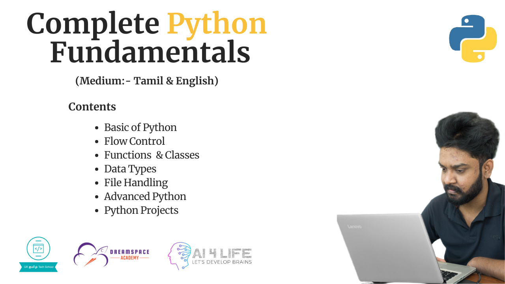

This repository contains scripts that explains the basic fundamentals of Python programming. This is  very useful for beginner programmers to learn Python and use these scripts as references to code when they need helps.

This scripts are based on a YouTube tutorial that was posted as playlist at GR Tech School Channel.

* Python Playlist: [Tutorial Videos](https://www.youtube.com/watch?v=rNIK271FiVI&list=PLk4mEzA6dvTLsrvIPbxLfEWX6f3CJlsiQ)


* Source Code: [Coding Examples](source/)

# Python Source Code

## 0-hello-world.py

```py

print("Hello World!") # print() method display data on consloe.

```

## Output

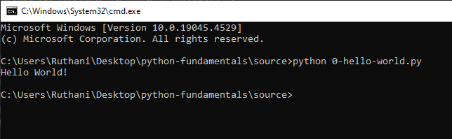

## 1-variable.py

```py

data1 = "10"  # String
data2 = 5	  # Int		
data3 = 5.23  # Float
data4 = False # Bool


print(data1)
print(data2)
print(data3)
print(data4)

```

## Output

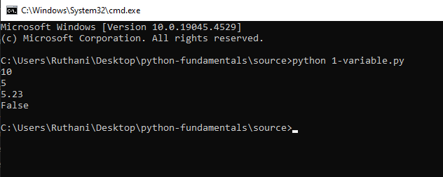

## 2-data-types.py
 
```py

data1 = "10"  # String
data2 = 5	  # Int		
data3 = 5.23  # Float
data4 = False # Bool


print(type(data1))
print(type(data2))
print(type(data3))
print(type(data4))

```

## Output

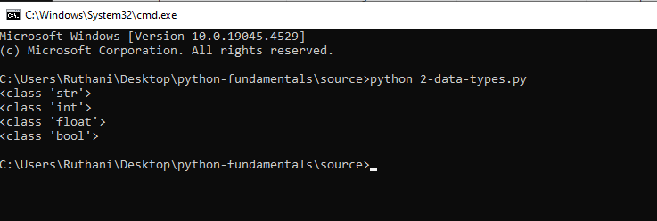

## 3-comments.py

```py


print("Hello World") # This function prints text on console.


# This is a single line comment 


'''

This is 

Multi 

line comments


'''


```

## Output

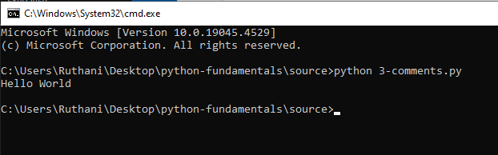

## 4-arithmetic.py

```py

#  +	  Addition	
#  -	  Subtraction	
#  *	  Multiplication	
#  /	  Division

#  %	  Modulus		
#  **	  Exponentiation		
#  //	  Floor division	


num1 = 10
num2 = 2

print(num1 + num2)
print(num1 - num2)

print(num1 * num2)
print(num1 / num2)


print(100 % 3) 
print(2**8) 
print(10 // 2.4)


```

## Output

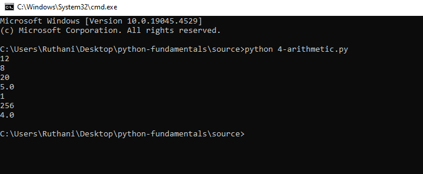


## 5-comparison-operators.py

```py

#   ==    Equal	
#   !=    Not equal	
#   >	  Greater than	
#   <	  Less than	
#   >=    Greater than or equal to	
#   <=    Less than or equal to	


```

## Output

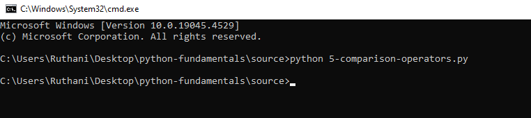

## 6-user-input.py

```py

number1 = int(input("Enter number 1? "))
number2 = int(input("Enter number 2? "))


print("Total: {}".format(number1 + number2))

print(f"Total: {number1 + number2}")


```

## Output

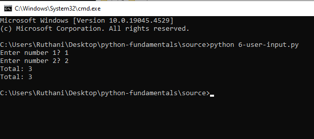

## 7-if-condition.py

```py

post = input("Enter your post? ")

if name == "badwords":
	print("Hi, you are welcome")

else:
	print("Hi, I don't know you")


```

## Output

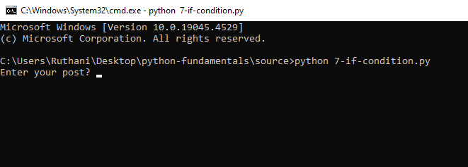

## 8-if-else-condition.py

```py

database_username = "gunarakulan"
database_password = "guna12345"


user_entered_username = input("Please enter your username? ")
user_entered_password = input("Please enter your password? ")

                         
if database_username == user_entered_username and database_password == user_entered_password:
	print("You are logged in")

else:
	print("Username or password is wrong")


```

## Output

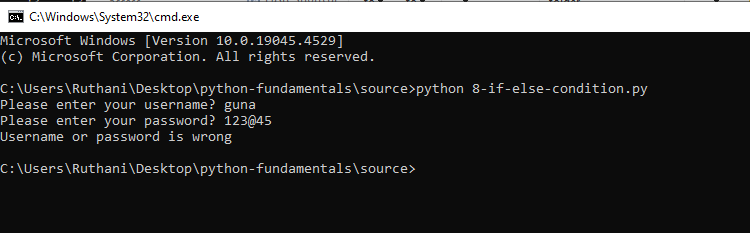

## 9-logical-operators.py

```py

name1 = "guna"
name2 = "rakulan"
name3 = "gunarakulan"


if "g" not in name1:
	print("True")

else:
	print("False")

```

## Output

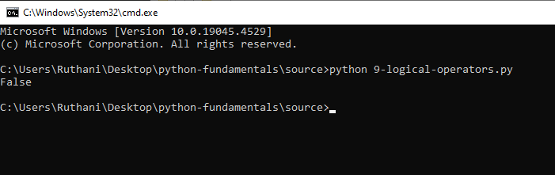

## 10-comparison-operators.py

```py

num1 = 2
num2 = 2


if num1 != num2:
	print("True")


```

## Output

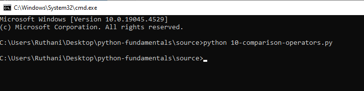

## 11-if-elif-else-condition.py

```py

name = input("Enter your name? ")


if name == "guna":
	print("1234567890")

elif name == "david":
	print("0987654321")

elif name == "rakulan":
	print("12345")

elif name == "raj":
	print("1234455667")
else:
	print("No contacts found")


```

## Output

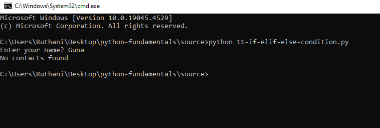


## 12-datatype-casting.py

```py

number1  = input("Enter number1 ")
number2  = input("Enter number2 ")

print(int(number1) + int(number2))

```

## Output

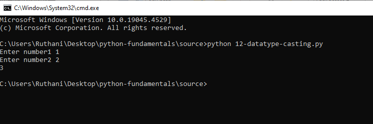

## 13-string-concatenation.py

```py

name = input("What's your name? ")
age = input("How old are you? ")
job = input("what's your job")
place_of_work = input("where do you work?")
likes = input("What do you like? ")

story = f"Hi, My name is {name}. I am {age} years old. I am working as a {job} at {place_of_work} company. My free time activities are {likes}"

print(story)

```

## Output

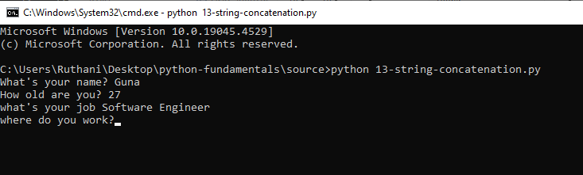

## 14-if-condition-simple-program-1.py

```py

# >= 35 = S
# >= 45 = C
# >= 65 = B
# >= 75 = A
# >= 90 = A+

subject_name = input("Please enter a subject name? ")
marks = int(input(f"Please enter your marks in {subject_name}? "))

if marks >= 0 and marks < 35:
	print("You failed in the exam")

elif marks >= 35 and marks < 45:
	print(f"You have recived S in {subject_name}")

elif marks >= 45 and marks < 65:
	print(f"You have recived C in {subject_name}")

elif marks >= 65 and marks < 75:
	print(f"You have recived B in {subject_name}")

elif marks >= 75 and marks < 90:
	print(f"You have recived A in {subject_name}")

elif marks >= 90 and marks <= 100:
	print(f"You have recived A+ in {subject_name}")
else:
	print("Sorry, I could not process this")

```

## Output

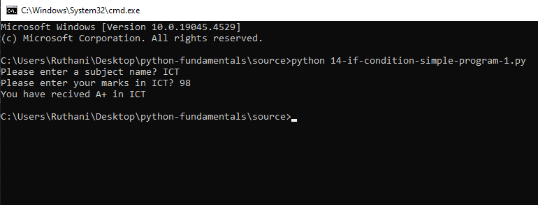

## 15-string-manipulation.py

```py
# 00 String as list
# 01 Looping string
# 02 Slicing
# 03 Length
# 04 strip()
# 05 lower()
# 06 upper()
# 07 replace("Guna", "Kuna")
# 08 split("|")
# 09 Check string "free" in txt
# 10 String Concatenation f string
# 11 String Concatenation Format


#list
name = "This is a simple text"
print(name[1])


#Looping

for c in name:
	if "s" == c:
		print("S found")

# Slicing
print(name[5:]) 
print(name[5:7])

#upper lower()
data = input("Enter some data? ")
print(data.upper())
print(data.lower())


#replace

newValue = input("Enter your name? ")
print(newValue.replace("My name is", "I am"))


#Split 
textData = "apple | orange | dog | cat"
textData = textData.split("|")
print(textData[1])


userData = input("Enter something: ")

if "kill" in userData:
	print("Bad sentance")
else:
	print("good sentance")


#String Concatenation f string

data1 = "hello"
data2 = "bye"

print(f"{data1} {data2}")

print("{} {}".format(data1, data2))


```

## Output

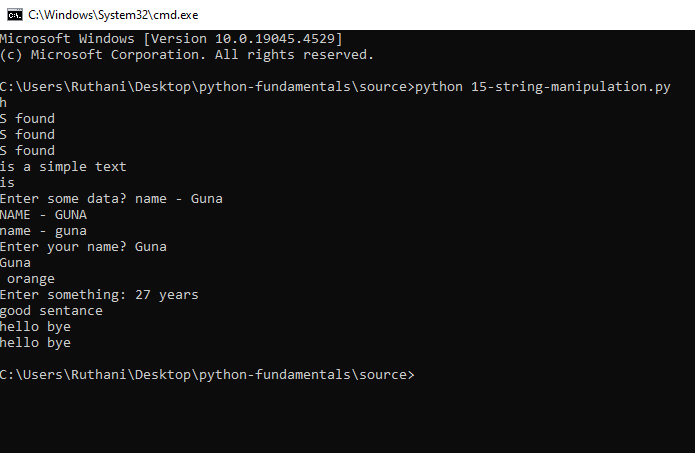

## 16-list.py

```py

database = ["David", "John", "Mike", "Tim"]

username = input("Enter your username? ")

for x in database:
	if x == username:
		print("Your name has been found in the database")
		break
	else:
		print("Sorry, Your name did not find in the database")


```

## Output


## 17-list-method-1.py

```py

#append()
#insert()
#remove()
#pop() del name[0]
#clear()
#reverse()

# append
objects = ["car", "bike", "phone", "computer", "laptop"]
objects.append("dog")
print(objects)


#insert
objects.insert(1, "headphone")
print(objects)

#remove
objects.remove("headphone")
objects.remove("dog")
objects.pop(1)
del objects[0]
print(objects)

#reverse
objects.reverse()
print(objects)

#clear
objects.clear()
print(objects)


```

## Output

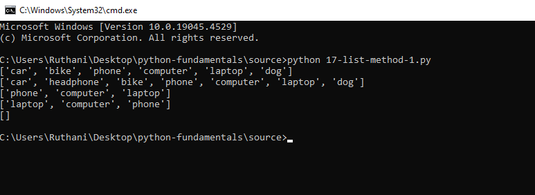

## 18-list-method-2.py

```py

# copy
# merge / extend
# count
# index

# copy
objects = ["car", "dog", "phone", "cup", "laptop"]
objects2 = objects.copy()
objects.remove("dog")
print(objects)
print(objects2)


# merge
list1 = ["dog", "cat", "phone"]
list2 = ["laptop", "apple", "orange","laptop"]

#totalList = list1 + list2
list1.extend(list2)

#print(list1)

print(list1.count("dog"))

print(list1.index("orange"))


```

## Output

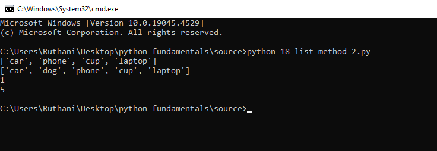

## 19-loop-part-1.py

```py

for x in range(100,1000,10):
	print(x)


for x in range(50):
	print("Hello World")

```

## Output

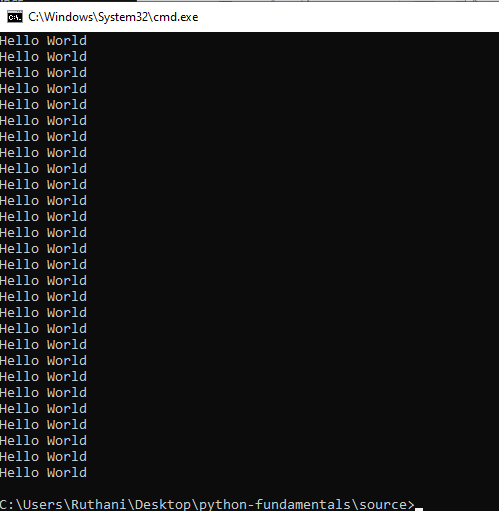

## 20-loop-part-3.py

```py

for x in range(100):
	print(x)

else:
	print("Finished")


names = ["David", "Mike", "Tim", "Guna"]

for x in names:
	print(f"My name is {x}")

```

## Output

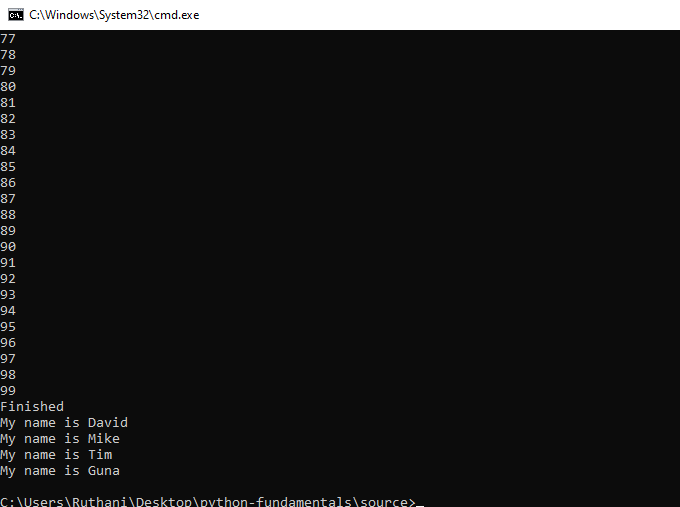

## 21-loop-part-2.py

```py

how_many_time = input("Enter how many do you want to print? ")
username = input("Enter your name? ")

for x in range(int(how_many_time)):
	print(f"{username} : {x+1}")

```

## Output

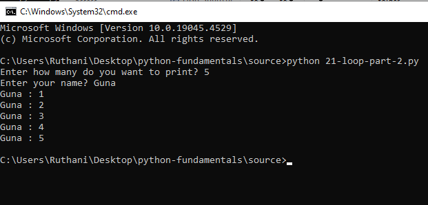

## 22-break-and-continue-in-python.py

```py

for x in range(100):
	
	if x == 50:
		continue

	


```

## Output

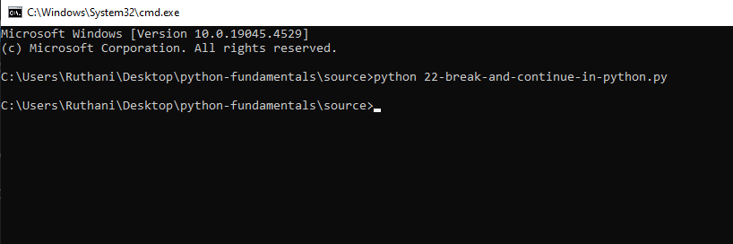

## 23-while-loop.py

```py


x = 0

while (x<=100):

	print(x)
	
	x = x + 5
else:
	print("Finished")


while True:
	userInput = input("Enter: ")


	if userInput == "car":
		print("Car is nice")

	elif userInput == "stop":
		break


```

## Output

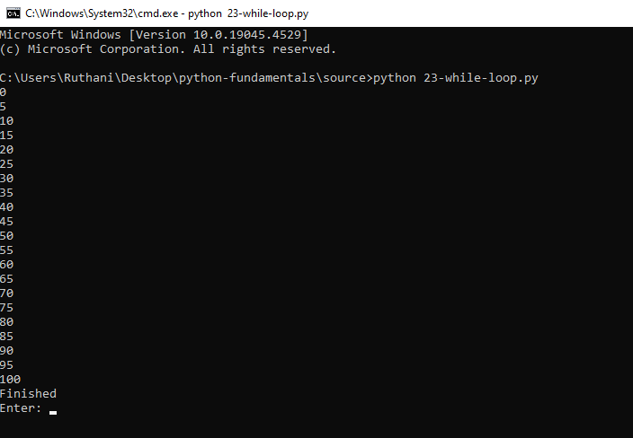

## 24-tuple-python.py

```py

objects1 = ("bmw", "david", "Mike", "tim")
objects2 = ("table", "phone", "laptop")

totalObjects = objects1 + objects2

convertedToList = list(totalObjects)

convertedToList.append("Last Element")


print(convertedToList)

print(type(convertedToList))


for x in totalObjects:
	print(f"Object name is {x}")


```

## Output

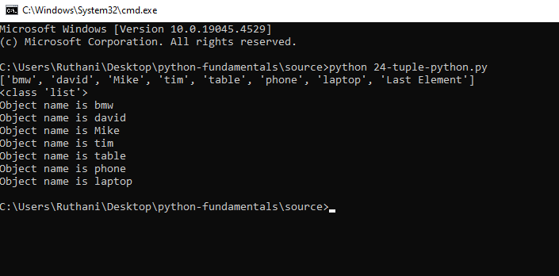

## 25-sets-in-python.py

```py

#list
#tuple
#set

#random
#loop
#checking
#add
#update
#len
#remove
#discard
#pop()
#clear


objects = {"daivd", "table", "laptop", "phone", "Mike"} # ramdom 

for x in objects:
	print(x)

if "daivd" in objects:
	print("Yes, It has david")

objects.add("Guna1")
objects.update(["Guna", "Rakulan", "Gunarakulan"])

print(objects)
print(len(objects))

objects.remove("Rakulan")
objects.discard("Guna1")

objects.pop() #
objects.clear()

print(objects)


```

## Output

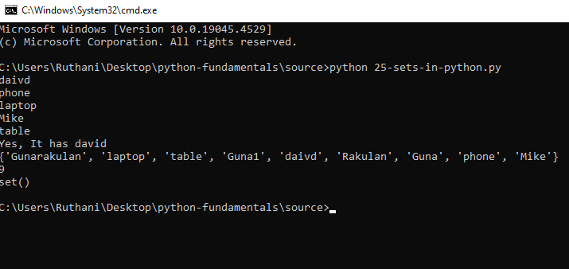

## 26-sets-in-python-2.py

```py

#union() 
#intersection()
#difference()

x = {"banana", "orange", "apple", "kiwi"}
y = {"apple", "mango", "cherry", "blueberry", "kiwi"}

result = y.difference(x)

print(result)


```

## Output

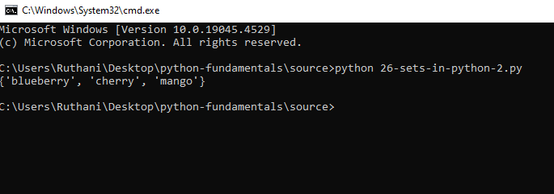

## 27-dictionary-in-python.py

```py

person1 = {"name":"gunarakulan", "age":23, "dob":324324}

company1 = {"network_size":3432432, "company_name":"ABC1"}


person1["job"] = "Software Engineer"

print(person1.get("name"))

print(person1["name"])

print(person1["job"])

```

## Output

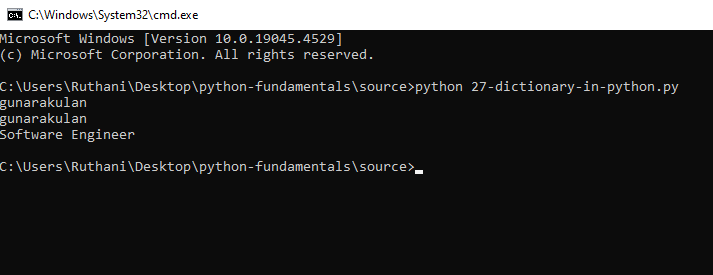

## 28-how-to-loop-a-dictionary-in-python.py

```py

person1 = {"name":"david", "age":66, "job":"Web Developer", "From":"USA"}


# Method 1

for x in person1:
	print(person1[x])

# Method 2

for x in person1.keys():
	print(person1[x])

# Method 3

for x in person1.values():
	print(x)

# Method 4

for k, v in person1.items():
	print(f'{k}  {v}')

```

## Output

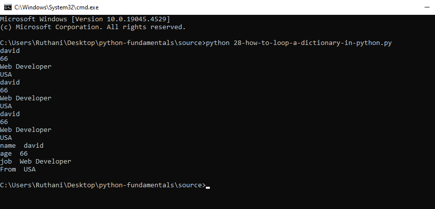

## 29-dictionary-methods-in-python.py

```py

person1 = {"name":"david", "age":66, "job":"Web Developer", "From":"USA"}


# Check If value exist
# len
# add
# pop("name")
# popitem()
# del person1['name']
# del person1
# clear()


if "name" in person1.keys():
	print("Yes, It exists")

if "david" in person1.values():
	print("Yes, It exists")


print(len(person1))


person1["new_info"] = "This is a new value"

person1.popitem()
print(person1)


person1.popitem() # Removes last item


# Delete elements from dictionary 
del person1['name']
person1.popitem()
person1.popitem() 

#Remove the dictionary
person1.clear()

print(person1)

```

## Output

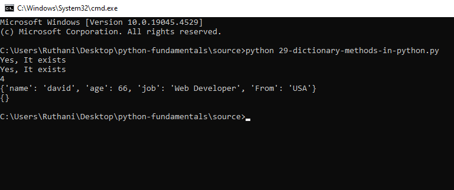

## 30-nested-dictionary-in-python.py

```py
# Copy
# dict(name)
# Nexted dictionary
# Change value

employee = {"name":"David", "age":45, "job":"Engineer"}
employee.pop("job")

new_dic = employee.copy()
new_dic_2 = dict(new_dic)


print(new_dic)

employee = {

"employee_1":{"name":"David", "age":45, "job":"Engineer"},
"employee_2":{"name":"Frank", "age":32, "job":"Web Developer"},
"employee_3":{"name":"Guna", "age":24, "job":"Engineer"}

}


print(employee["employee_2"]["job"])

```

## Output

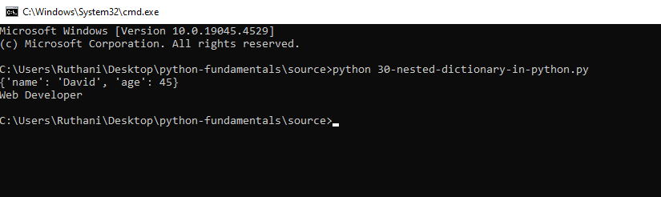

## 31-function-in-python.py

```py

def sayHello():
	print("Hi, This is a simple computer program!")


sayHello()


for x in range(100):
	sayHello()


```

## Output

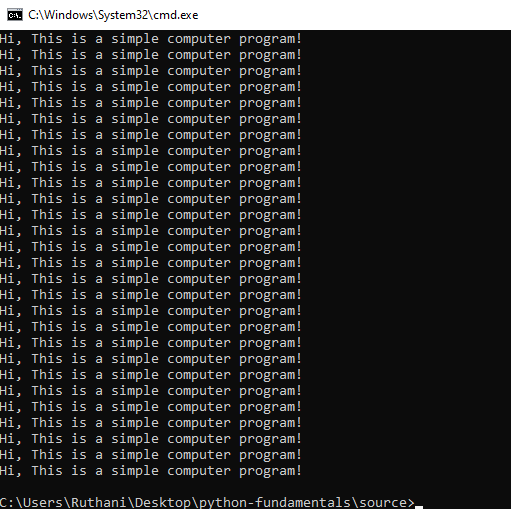

## 32-function-parameters-in-python-(part-01).py

```py

def printName(name):
	print(f"Hello, My name is {name}")


printName("David")
printName("Guna")
printName("Frank")


```

## Output

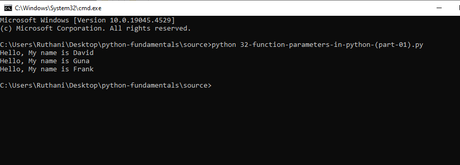

## 33-function-parameters-in-python-(part-02).py

```py

def fullNameFunction(fname, lname, age):
	print(f"My full name is {fname} {lname}, and I am {age} years old")


fullNameFunction("Gunarakulan", "Gunaretnam", "23")

fullNameFunction("David", "Frank", "32")


def add_function(num1, num2):
	print(num1 + num2)


def sub_function(num1, num2):
	print(num1 - num2)

add_function(12, 8)
add_function(120,30)

sub_function(10, 5)
sub_function(100, 5)


def add_function(num1, num2, operator):

	if(operator == "+"):
		print(num1 + num2)

	elif(operator == "-"):
		print(num1 - num2)

	elif(operator == "*"):
		print(num1 * num2)

	elif(operator == "/"):
		print(num1 / num2)


number1 = int(input("Enter number one "))
number2 = int(input("Enter number two "))

operator = input("What do you want to do (-, +, *, /)?")

add_function(number1, number2, operator)

```

## Output

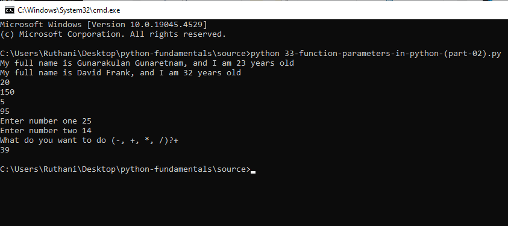

## 34-keyword-arguments-with-function-in-python-(part-01).py

```py

def printName(*name):

	print(len(name))
	
	for x in name:
		print(f"My name is {x}")


printName("guna","rakulan", "gunarakulan", "Frank", "David")

```

## Output

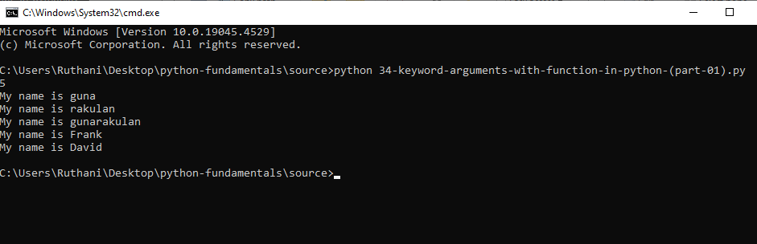

## 35-keyword-arguments-with-function-in-python-(part-02).py

```py


'''
def print_name(fname, lname, age, job):
	print(f"Hi, My name is {fname} {lname}. I am {age} years old. I am working as a {job}")

print_name(lname= "Rakulan", age="24", job="Software Developer", fname = "Guna")

'''


def print_name(**data):
	print(f"Hi, My name is {data['fname']} {data['lname']}. I am {data['age']} years old. I am working as a {data['job']}")


print_name(fname = "Guna", lname ="Rakulan", age="24", job="Programmer")

```

## Output

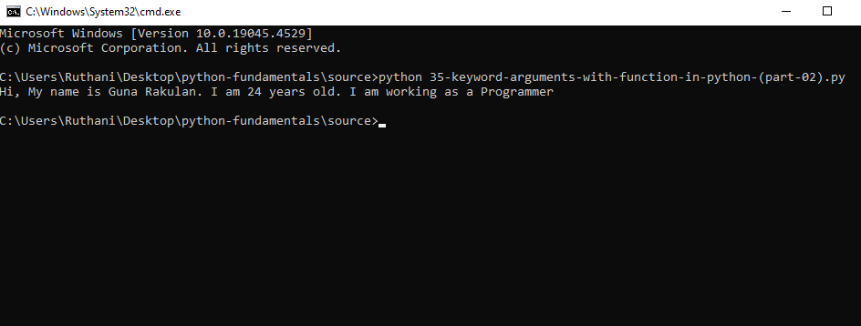

## 36-how-to-return-values-from-functions-in-python.py

```py

'''

def print_name(data):
	for x in data:
		print(f"My name is {x}")


names1 = ["Guna", "Rakulan", "Kim", "Tim"]
names2 = ["David", "Frank", "Job", "Bill"]


print_name(names1)

print_name(names2)


def print_name(data):
	for k in data:
		print(f"{k} : {data[k]}")


dic1 = {"name":"guna", "age":"24", "job":"Developer"}

print_name(dic1)


def print_name():
	return "Hello"


name = print_name()

print(name)


'''


def addition(*numbers):

	total = 0

	for x in numbers:
		total = total + x

	return total

print(addition(12,23,43,45,5))


```

## Output

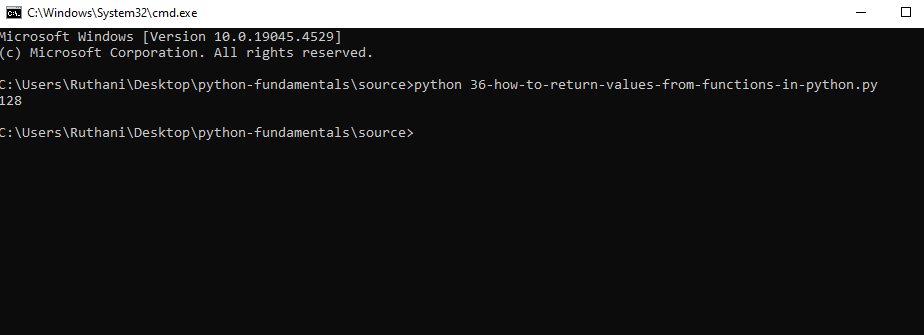

## 37.scope-in-python.py

```py

name = "Computer"


def green_box():
	green_name = "Computer 5"
	print(green_name)


```

## Output

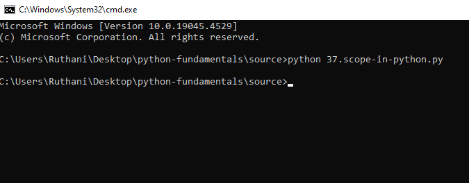


## 38-module-in-python.py

```py

import gr_module
import own_artthimatic


gr_module.print_name()

total_value = own_artthimatic.add_function(12,323,12,12,3,12,312,3,12,3,12,3,2312)

print(total_value)

```

### gr_module.py

```python

def print_name():
	print("My name is Gunarakulan")


	
```

### own_artthimatic.py

```python

def add_function(*numbers):

	total = 0

	for x in numbers:
		total = total + x

	return total


```


## Output

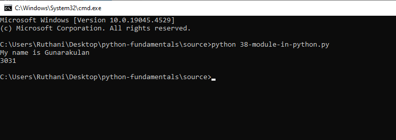

## 39-datetime-in-python-(part-1).py

```py

import datetime

current = datetime.datetime.now()

print(current.strftime("%d-%b-%Y %H:%M:%S"))

'''
%a	Weekday, short version	Wed	
%A	Weekday, full version	Wednesday	
%w	Weekday as a number 0-6, 0 is Sunday	3	
%d	Day of month 01-31	31	
%b	Month name, short version	Dec	
%B	Month name, full version	December	
%m	Month as a number 01-12	12	
%y	Year, short version, without century	18	
%Y	Year, full version	2018	
%H	Hour 00-23	17	
%I	Hour 00-12	05	
%p	AM/PM	PM	
%M	Minute 00-59	41	
%S	Second 00-59	08	
%f	Microsecond 000000-999999	548513	
%z	UTC offset	+0100	
%Z	Timezone	CST	
%j	Day number of year 001-366	365	
%U	Week number of year, Sunday as the first day of week, 00-53	52	
%W	Week number of year, Monday as the first day of week, 00-53	52	
%c	Local version of date and time	Mon Dec 31 17:41:00 2018	
%C	Century	20	
%x	Local version of date	12/31/18	
%X	Local version of time	17:41:00	
%%	A % character	%	
%G	ISO 8601 year	2018	
%u	ISO 8601 weekday (1-7)	1	
%V	ISO 8601 weeknumber (01-53)	01

'''

```

## Output

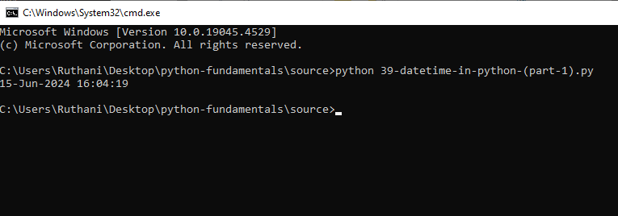

## 40.set-time-in-python-datetime.py

```py

import datetime

my_time = datetime.datetime(2017, 6, 13, 12,22,45)

print(my_time.strftime("%Y"))

```

## Output

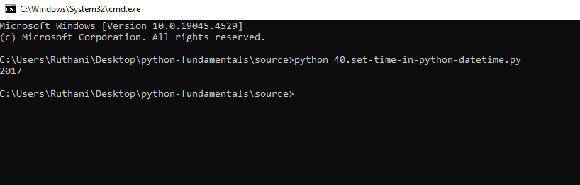

## 41-math-module-in-python.py

```py

import math


min_result = min(10,323,32,2)
max_result = max(10,323,32,2)

print(f"Min {min_result}")
print(f"Max {max_result}")

pow_result = pow(2, 8)

print(f"Power 2**8: {pow_result}")

sqrt_result = math.sqrt(1001) 

print(f"SQRT of 1001: {sqrt_result}")


print(f"Value of PI {math.pi}")

print(math.floor(5.4)) # 5

print(math.ceil(5.4)) # 6


print(round(5.5))


```

## Output

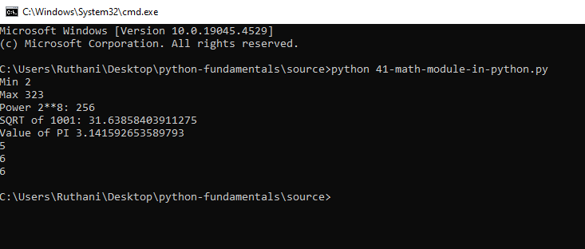

## 42-regular-expression-in-python.py

```py

import re

text = "Hello, My name is Gunarakulan, My phone number is 1234567890. I like %$^&*(&^%$#&^"

result = re.findall("[0-9]", text)

print(result)


#[a-z]
#[A-Z]
#[a-zA-Z]


```

## Output

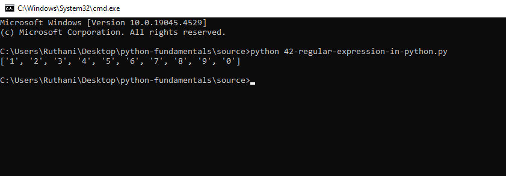

## 43-pip-in-python.py

```py

import cv2


```

## Output

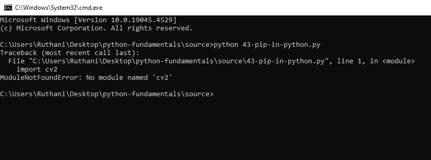

## 44-try-and-except-in-python.py

```py


'''
try:

	prit("Hello")

except Exception as e:
	print("Something went wrong!")


try:

	prit("Hello")

except Exception as e:
	if(str(e) == "name 'prit' is not defined"):
		print("Please check the keyword")


'''


try:

	print("Hello")

except Exception as e:
	if(str(e) == "name 'prit' is not defined"):
		print("Please check the keyword")
finally:
	print("It always works")


```

## Output

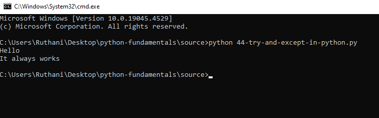

## 45-file-handling-in-python.py

```py

'''

"r" - Read - Default value. Opens a file for reading, error if the file does not exist

"w" - Write - Opens a file for writing, creates the file if it does not exist

"a" - Append - Opens a file for appending, creates the file if it does not exist

"x" - Create - Creates the specified file, returns an error if the file exists


"t" - Text - Default value. Text mode

"b" - Binary - Binary mode (e.g. images)


file = open("sample-text.txt", "rt")
file.write("Hello")
#print(file.readlines()[2])
file.close()


file = open("sample-text.txt", "at")
file.write("\n The third content")

file.close()

'''


file = open("sample-text-2.txt", "xt")
file.write("this is new text")

file.close()

```

## Output

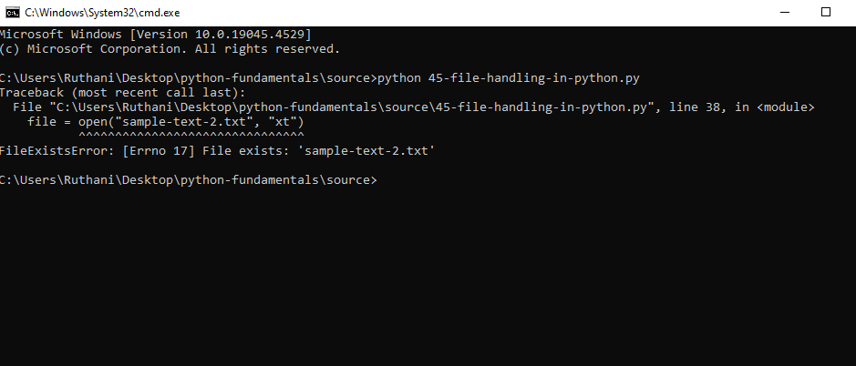


## 46-remove-files-and-folders.py

```py

import os 

os.remove("car1.jpg")


os.rmdir("my-data")

os.mkdir("A new folder is created by a python script")

```

## Output

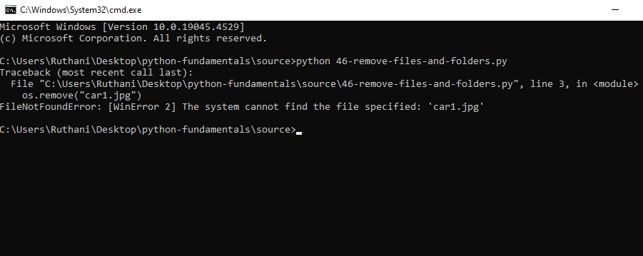

## 47-random-module-in-python.py

```py

import random 


'''

for x in range(100):

	print(random.uniform(1, 50))


#random.random()
#random.randint(1,200)
#random.randrange()
#random.triangular() Floating point numbers
#random.uniform()


names = ["guna", "rakulan", "python", "c++"]

print(random.choice(names))


'''

names = ["guna", "rakulan", "python", "c++"]
random.shuffle(names)

print(names)


```

## Output

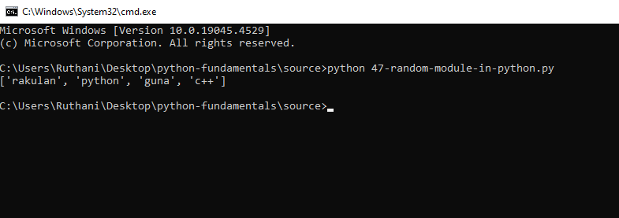

## 48-simple-program-1.py

```py

total = 0

# total = 0 + 0 = 0
# total = 0 + 1 = 1
# total = 1 + 2 = 3


for x in range(100):
	total = total + x

print(total)


```

## Output

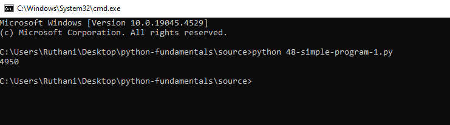

## 49-simple-program-2-odd-event-number.py

```py

numberValue = input("Please enter a number: ")


for x in range(1,int(numberValue)):


	if x % 2 == 0:
		print(f"Even {x}")

	else:
		print(f"Odd {x}")


```
## Output

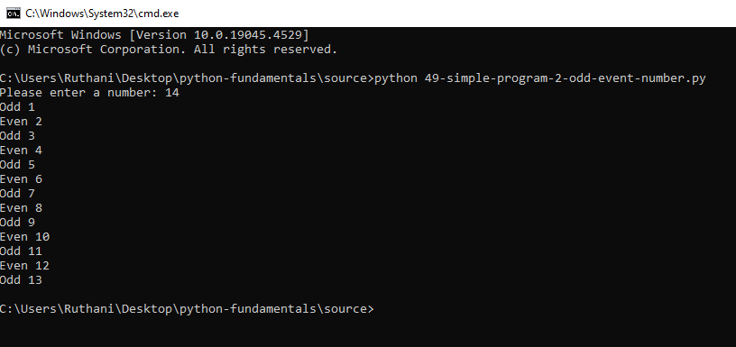

## 50-simple-program-password-generator.py

```py

import random

data = "qwertyuiop[]asdfghjkl;'zxcvbnm,./`1234567890-=QWERTYUIOP{}|ASDFGHJKL:ZXCVBNM<>?~!@#$%^&*()_+"

length = int(input("Please enter the length of the password that you want to generate? "))

generated_password = "".join(random.sample(data, length))

print(f"The generated password is:- {generated_password}")


```
## Output

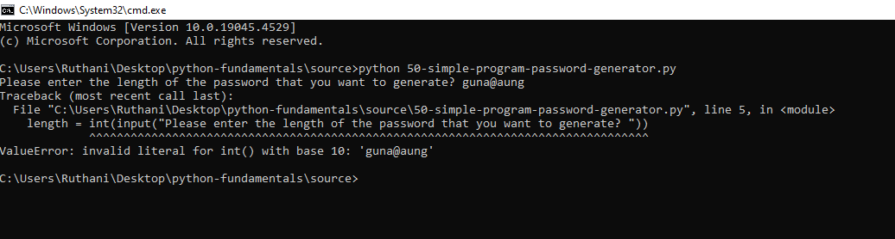

## 51-simple-program-4.py

```py

while True:

	user_input = input("Enter something: ")

	f = open("data.txt", "at")
	f.write(user_input+"\n")

	if(user_input == "[STOP]"):
		f.close()
		break

```
## Output

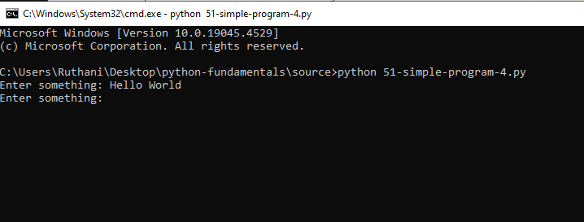

## 52-simple-program-5.py

```py

while True:

	user_data = int(input("Enter a number to check: "))

	if user_data % 2 == 0:
		print("It is an even number")

	else: 
		print("It is an odd number")

```
## Output

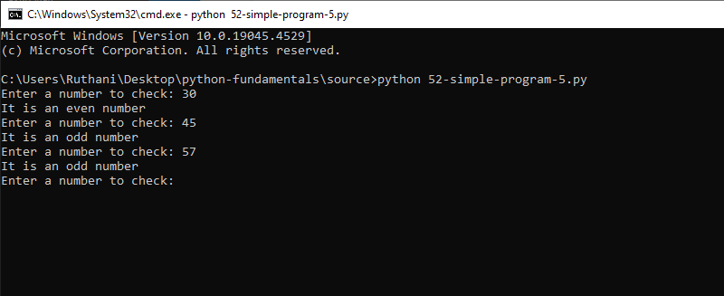


## 53-simple-program-6.py

```py

phones = {"guna":"23456432","rakulan":"3435643","mike":"324532","tim":"3456434","flo":"324565323","david":"4543245"}


while True:
	user_data = input("Enter the name: ")
	phone_number = phones[user_data]

	print(f"{user_data} : {phone_number}")

```
## Output

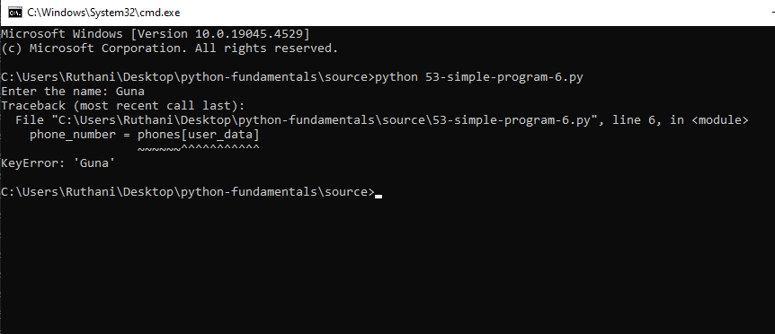

## 54-simple-program-7.py

```py

import os 
import random  


user_input = int(input("How many folders do you want to create? "))


for x in range(user_input):
	folder_name = random.randrange(1000, 10000)
	os.mkdir(str(folder_name))


```
## Output

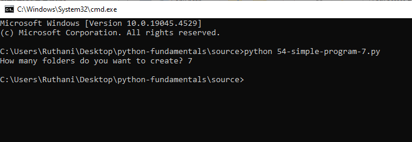