# Bucky Snippets

## 01-if-condition

### 01-string-testing

#### DataName.py


```python

name="hackejr";

if name is "guna":

	print("You are welcome "+name);
	
elif name is "joker":

	print("You are Welcome "+name);
	
elif name is "hacker":

	print("You are welcome "+name);
	
else:

	print("Sorry, Your username is not in the database. "+name);
	

```


#### Output

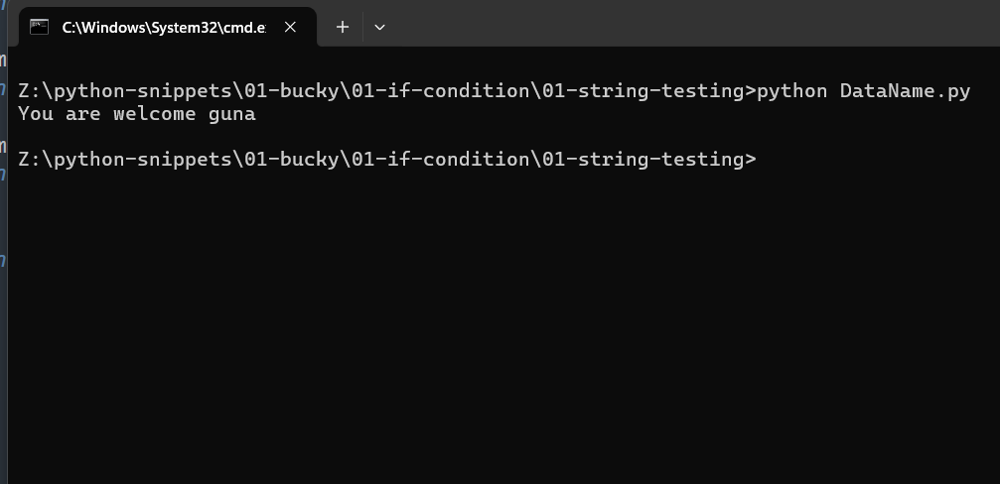

### 02-number-testing

#### Age.py


```python

age=22

if age < 25:

	print("Yes my age is less than 22")

```


#### Output

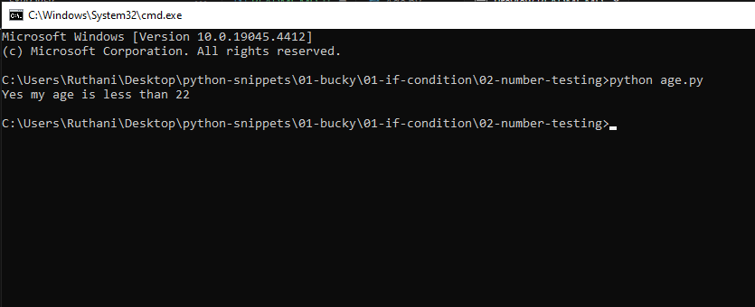

### 03-example

#### test.py

```python

num1=5;
num2=5;

if num1 is num2:

	print("Yes")
		

```

#### Output


### 04-exam-test

#### test.py

```python
java=60;

if java >= 35 and java <=45:

	print("You got S in JAVA")
	
elif java >=45 and java <=65:

	print("You got C in Java")
	
elif java >=65 and java <=75:

	print("You got B in Java")
	
elif java >=75 and java <=100:

	print("You Got A in Java")
	

elif java==0:

	print("You got F in Java")
	
elif java <35:

	print("You got W in Java")
	
else:

	print("Wrong Input");
	
	

```

#### Output

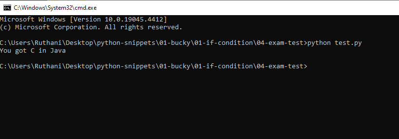

## 02-for-loop

### 01-example

#### loop.py


```python

foods=["Joker","Hacker","Guna","Rakulan","Maker"] #Array.

for i in foods: #for in loop.
	print(i)

```

#### Output

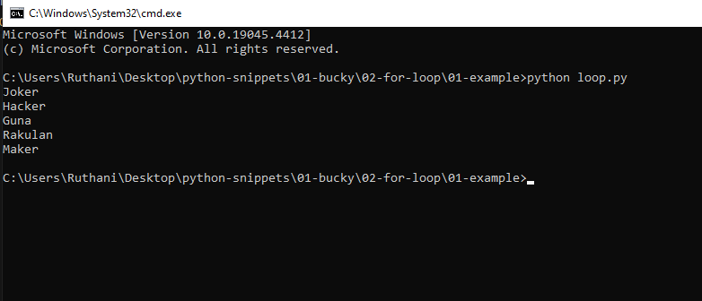

### 02-range()

#### foorloop.py


```python

for x in range(5):    
	print("Number ",x)  #, is just like a concatination.


```

#### Output

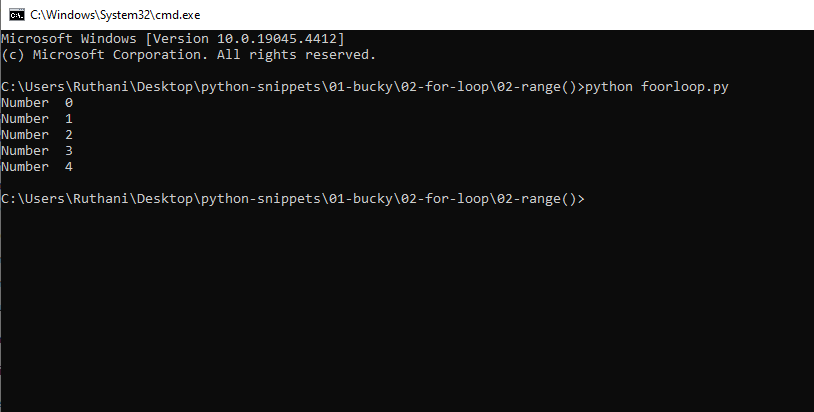

### 03-range(3,9)

#### loop3.py


```python

for n in range(3,9):
	print("Number ",n)
	

```

#### Output

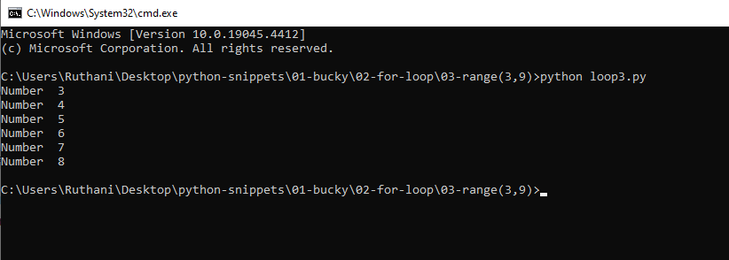

### 04-incrementing

#### loop.py


```python

for v in range(0,50,5): #0 is starting poiny.
	print(v)			#50 is the ending point
						#5 is the incrementing.

```

#### Output

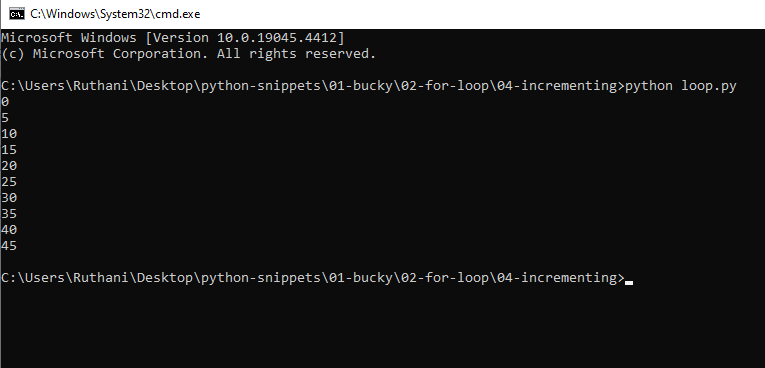

### 05-while

#### while.py


```python

num=5

while num <= 10:

	print(num)
	num+=1

```

#### Output

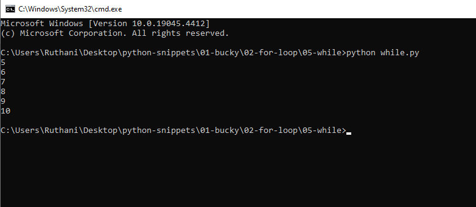

## 03-continue

### main.py


```python
nums=[2,3,5,9,11,15,20]

for s in range(0,20):

	if s in nums:
	 	continue

	print(s)
	
#continue skip 
#break will stop program

```

#### Output

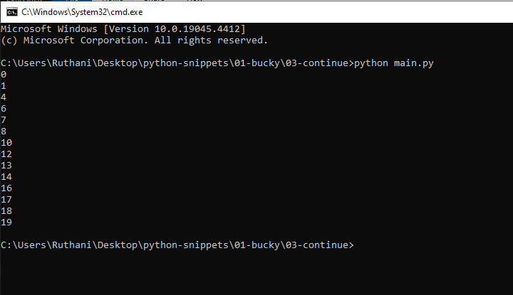

## 04-function

### 01-example

#### my.py


```python

def exampleFunction():
	print("This is the sample function")

exampleFunction(); # call the function.

#def is the keyword for making a function.
#inside the parentheses we are able to pass argument values.


```

#### Output

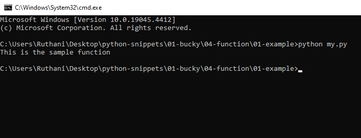

### 02-bitcoin-converter

#### my.py


```python

#This program convert the bitcoin values into us dollers.

def converter(btamount):
	totalvalue=btamount*525
	print(totalvalue)

converter(1)
converter(8)
converter(5)

```

#### Output

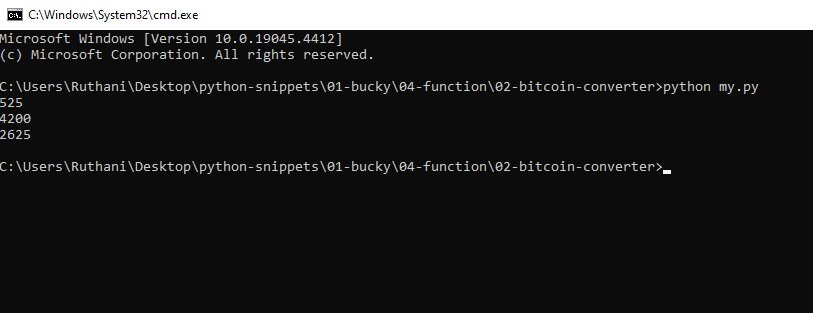

### 03-return-function

#### my.py


```python

def boyParterAgeGuseser(boyage):
	age=boyage/2+7
	return age


print(boyParterAgeGuseser(21))
# we can also catch the value in a variable.

```

#### Output

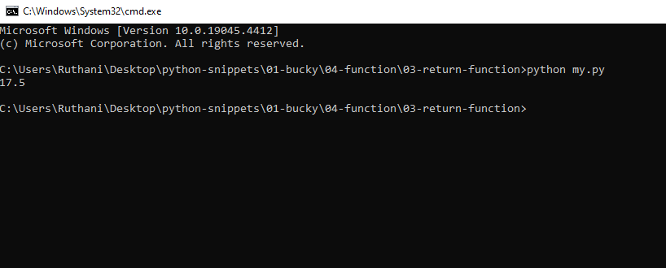

### 04-default-argument

#### my.py


```python

def genter_user(sex="Unkonwn"): #default argument value value.
	if sex is "M":
	
		sex="Male"

	elif sex is "F":
		sex="Female"

	print(sex)


genter_user("M") # male
genter_user("F") #female
genter_user()  #unkonwn


#if the user does not provide the sex. by deafult it would be assigned Unknown


```

#### Output

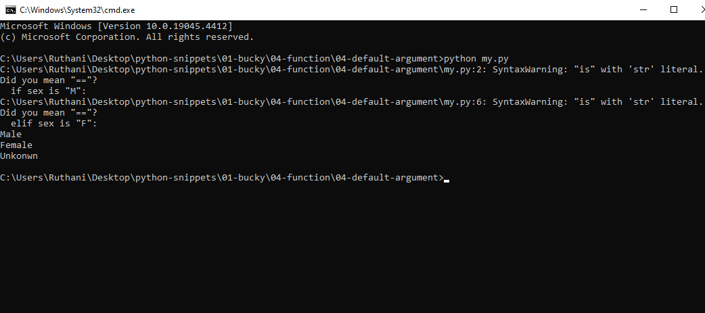

### 05-keyword-arguments

#### my.py


```python

def function1(name='Guna',action='ate',item='Pizza'):
	print(name,action,item)

function1()

function1(item="Handbager")

#by using this method we can pass to a specific arguments.

```

#### Output


### 06-unlimited-arguments

#### my.py


```python

def calculatorForAdding(*args):
	total=0
	for n in args:
		total+=n

	print(total)


calculatorForAdding(10,2,3,5,6,6,5,8)


#This program takes unlimited numbers of arguments.


```

#### Output

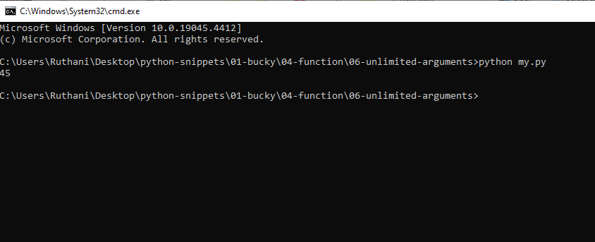


### 07-unpack-arguments

#### my.py


```python

def helthCalculator(age,apple_ate,smoke):
	answer=(100-age)+(apple_ate*3.5)-(smoke*2)
	print(answer)


guna_data=[21,20,0]
joker_data=[21,10,0]

helthCalculator(guna_data[0],guna_data[1],guna_data[2])
helthCalculator(*joker_data) # This is called argument unpacking.


```

#### Output

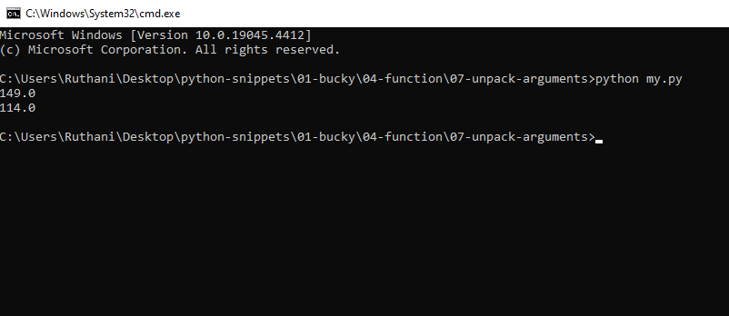

## 05-scope

### main.py


```python

#global variable can be accessed anywhere in the program in python.
#local variable can be only accessed whithin the function where it has been declared.

a=10 #global variable.

def fun1():

	print(a)

def fun2():
	b=5 # This variable cannot be used out of this function.
	print(b)


fun1();
fun2();


```

#### Output

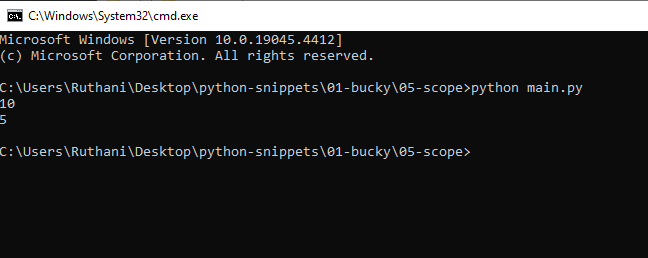


## 06-dictionary

### 01-example

#### my.py

```python

dictionaryWords={'kuna':'Good Person','joker':'Danger Person','hakcer':'Very talented Person'}

print(dictionaryWords) #print the whole dictionary.
print(dictionaryWords['joker'])#prints only the selected thing.


```

#### Output

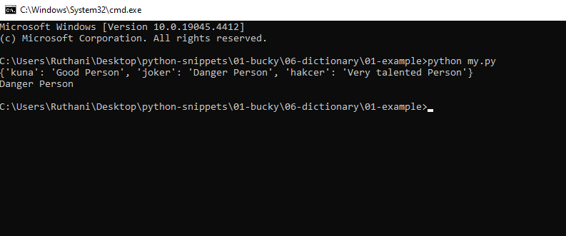

### 02-for-loop-for-dictionary

#### my.py

```python

dictionaryWords={'kuna':'Good Person','joker':'Danger Person','hakcer':'Very talented Person'}

for v,k in dictionaryWords.items():

	print(v+" "+k)


```

#### Output

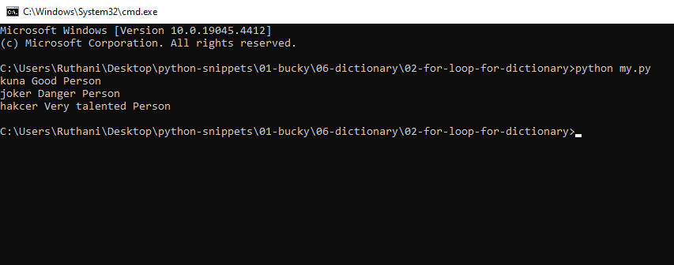

## 07-modules

### classFile.py


```python

def add(*args):
	total=0
	for s in args:
		total+=s
	print(total)

```
### usage.py

```python

import classFile

classFile.add(10,20,30,4,5)

```

#### Output

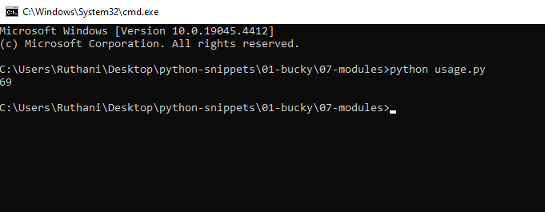

## 08-random

### main.py

```python

import random

print(random.randrange(1,200))

```

### Output

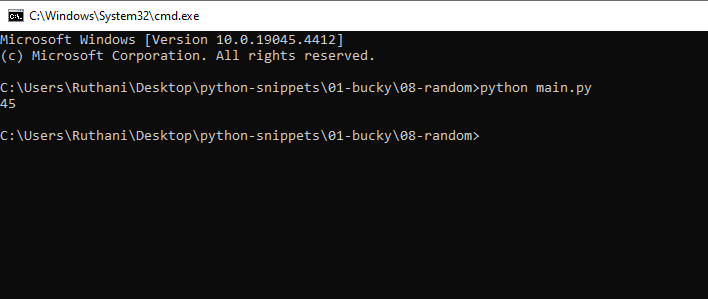

## 09-image-downloder

### image.py

```python

import random
import urllib.request

def downloadImage(url):
    urlname=random.randrange(1,1000)
    urlextension=str(urlname)+ ".jpg"
    urllib.request.urlretrieve(url,urlextension)

downloadImage("https://www.ophtek.com/wp-content/uploads/2014/08/java_tech-540x405.jpg")

```

### Output

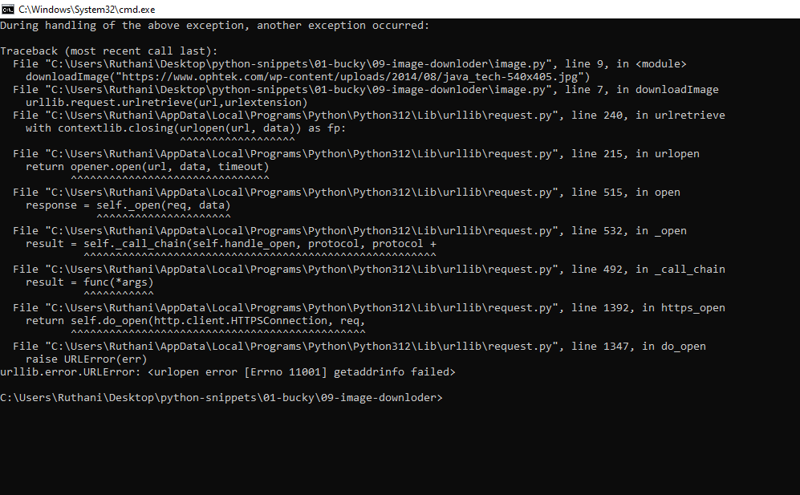

## 10-file-read-and-write

### main1.py

```python

fw=open("sam.txt",'w')
fw.write("Hello My name is guna \n")
fw.write("I work as an computer engineer")
fw.close()


fr=open("sam.txt","r")
text=fr.read()
print(text)
fr.close()

```

### Output

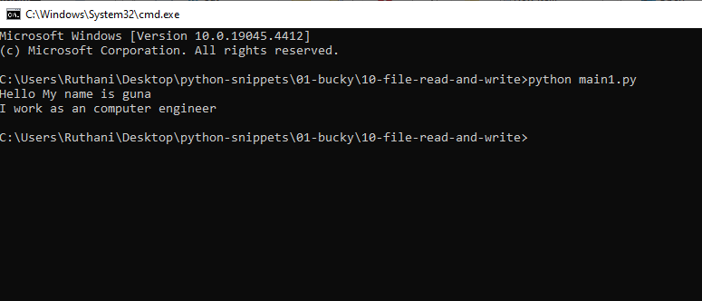

### main2.py

```python

fw=open("loop.txt",'w')
for s in range(10):
	fw.write(str(s)+"\n")

fw.close()

```

### Output

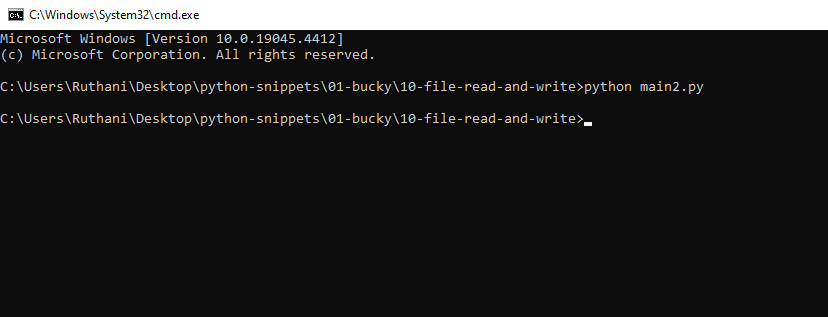


## 11-csv-file-download

### main1.py

```python

from urllib import request

filepath='http://localhost/k.csv'

def downloadCSVfile(filep):
	response=request.urlopen(filep)
	csv=response.read()
	csv_str=str(csv)
	lines=csv_str.split("\\n")
	dest_url = r'goo.csv'
	fx=open(dest_url,'w')
	for line in lines:
		fx.write(line+"\n")
	fx.close()


downloadCSVfile(filepath)


```

### Output

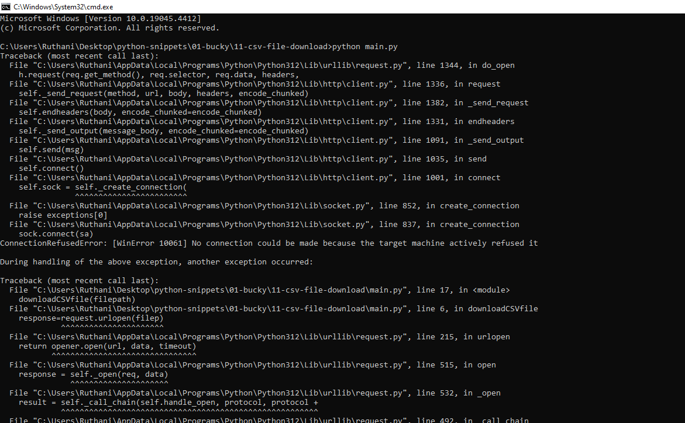

## 12-exception

### main1.py

```python

while True:
	try:
		number=int(input("What is your favorite number ?\n"))
		print(18/number)
		break
	
	except ValueError:     # in python we can defind the Error MSG and give specific solution for this.
						   # This is the ValueError.
		print ("Make sure and enter the right value")

	except ZeroDivisionError: #This is for ZeroDivisionError Error. It only expect for that specific Error.
		print("Do not pick zero")

	except:                   #This works for everything. If any Error finds in this application, it will thorw the exception.
		print("Someting went wrong")
	finally:                 #No matter what, It will work.
		print("I work whatever happens")
```

### Output

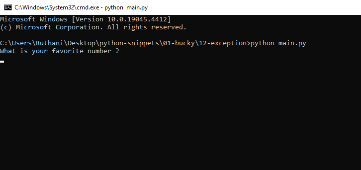

## 13-class

### class.py

```python

class Ememy:
	life = 3

	def attck(self):   #"self" keyword we can access the attributes and methods of the class in python.
		print("Ouch!..")
		self.life-=1   # we cannot directly use the name of variable like life.

	def checkLife(self):

		if self.life <= 0: 
			print("I am dead")

		else:
			print("The life left is " + str(self.life))


ememy1 = Ememy() #object
ememy2 = Ememy() #object

ememy1.attck()
ememy1.checkLife()

ememy2.checkLife()


#Objects are the instance of a class.
#ememy1 and ememy2 are the diffrent objects.


```

### Output

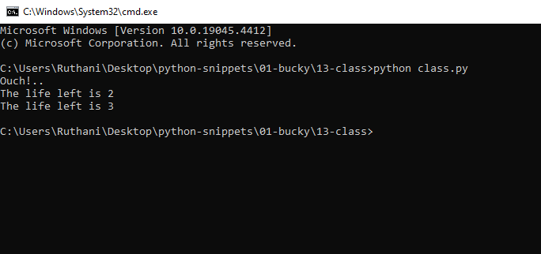

## 14-init

### Ex1.py

```python

class Tuna:

	def __init__(self): #__init__ is a self invoking function.
		print("Hello")


flip = Tuna()


```

### Output

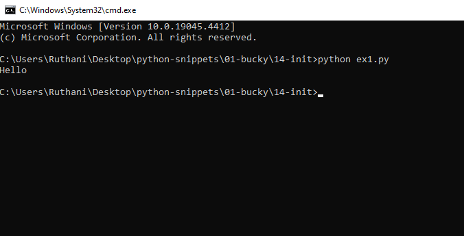

### Ex2.py

```python

class Ememy:

	def __init__(self,x):
		self.energy = x

	def get_evergy(self):
		print(self.energy)

jason = Ememy(5)
sandy = Ememy(18)


#This method called when an object is created from the class and it allow the class to initialize the attributes of a class.


```

### Output

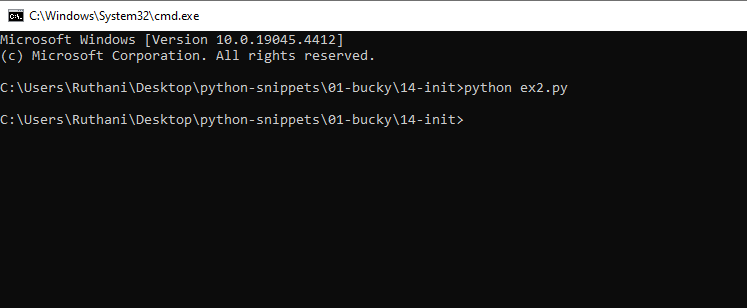

## 15-inheritance

### Ex1.py

```python

class Parent():
	def print_First_name(self):
		print("Guna")

class child(Parent): # child inherites from the Prarent
	def print_last_name(self):
		print("Rakulan")

guna = child()
guna.print_First_name();
guna.print_last_name();

```

### Output

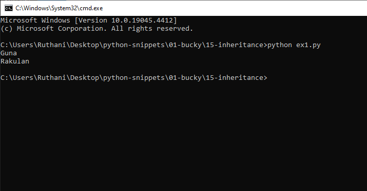

## 16-overwrite

### Ex2.py

```python

class Parent():
	def print_First_name(self):
		print("Guna")

class child(Parent): # child inherites from the Prarent
	def print_last_name(self):
		print("Rakulan")

	def print_First_name(self): #This is overwrite
		print("Gta")

guna = child()
guna.print_First_name();
guna.print_last_name();

```

### Output

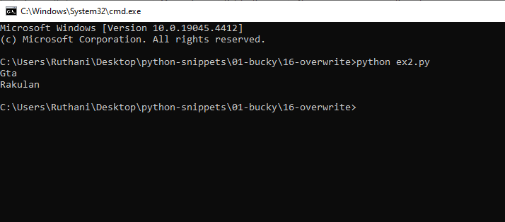

## 17-multiple-inheritance

### main.py

```python

class Mario():
	def move(self):
		print("I am moving");


class Shroom():
	def eat_shroom(self):
		print("I am big");

class BigMario(Mario,Shroom): #multi inher
	pass # to ignore the err


bm =BigMario();
bm.move();
bm.eat_shroom();


```

### Output

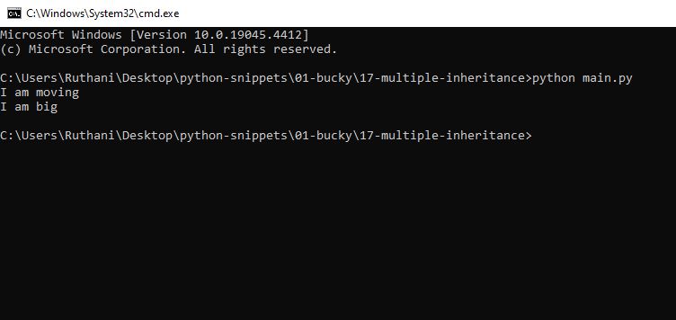

## 18-therading

### main.py

```python

import threading

class TheMesseanger(threading.Thread):
	def run(self):
		for _ in range(10): #_ means no variable.
			print(threading.currentThread().getName())


x=TheMesseanger(name="send");
y=TheMesseanger(name="receive");

x.start();
y.start();


```

### Output

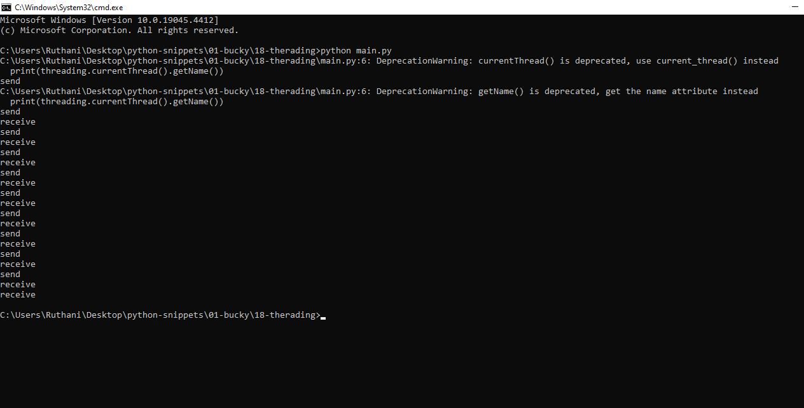

## 19-unpack-list

### main.py

```python

#item = ['kuna rakulan','jokerhacker','2018'];
#print(item[0]);

name,nickname,year=['kuna rakulan','jokerhacker','2018'];

print(nickname);
print(year);

#This is called variable unpacking.

```

### Output

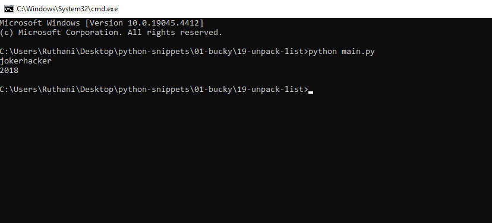

## 20-zip-list

### main.py

```python

first=["kuna",'joker','gta']
last=["rakulan",'hacker','gamer']

names=zip(first,last)

for a,b in names:
	print(a,b)


```

### Output

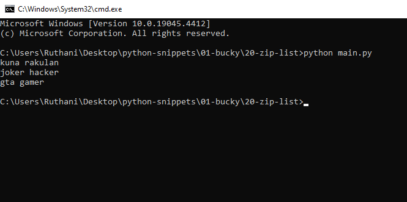

## 21-lambda

### main.py

```python

answer = lambda x:x*7
print(answer(5))

```

### Output

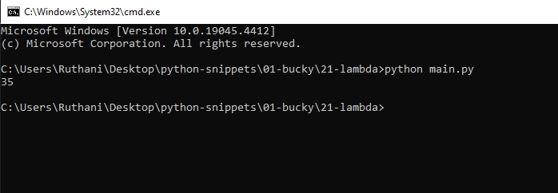

## 22-min-and-max

### main.py

```python

stock={
	
	'google':520.55,
	'fb':79.16,
	'yahoo':30.10,
	'amazon':306.23,
	'aapl':99.23
}

print("The min value is ",min(zip(stock.values(),stock.keys())))
print("The max value is ",max(zip(stock.values(),stock.keys())))
print(sorted(zip(stock.values(),stock.keys())))

#stock.values() is the number values.
#stock.keys() are the keys.
#At first we zip them together.
#Then we use min and max function.


```

### Output

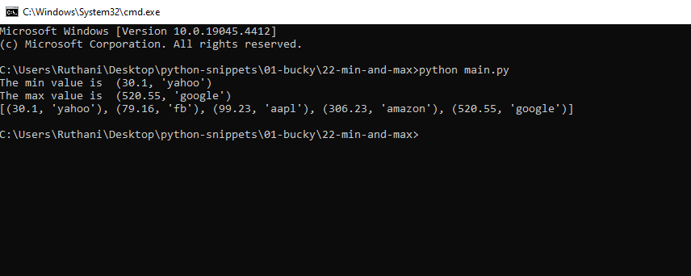

## 23-struct

### main.py

```python

from struct import *

#Store as bytes data.
packed_data = pack('iif',6,19,4.73)
print(packed_data)

original = unpack('iif',packed_data) 
print(original)

```

### Output

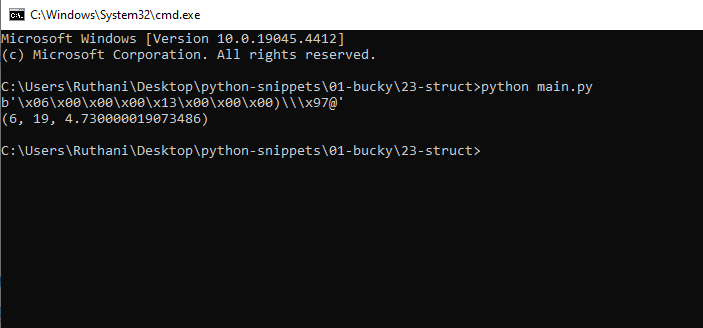

## 24-map

### main.py

```python

income = [10,30,75]

def double_money(dollers):
	return dollers * 2

new_income = list(map(double_money,income))
print(new_income)

#The map function will call the double_money function 3 times.
#we can do it with for loop, but this one is pertty easy.
#Bellow is the for loop version


#for x in income:
 #	var = double_money(x)
 #	print(var)


```

### Output

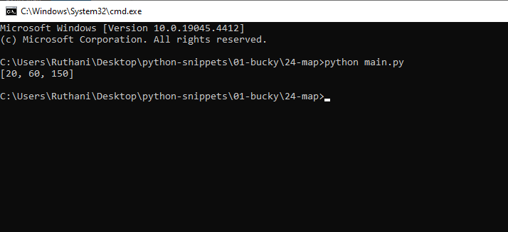

## 25-bitwise

### main.py

```python

#-------------Binary AND-------------------

a = 50		#110010
b = 25		#011001		
c = a & b	#010000

print(c)  # output is 16


#----------Binary RIGHT SHIFT---------------

x = 240    #11110000
y = x >>2  #00111100

print(y)


```

### Output


## 26-heapq

### main.py

```python

import heapq

grades = [32,454,656,676,8,9]
print(heapq.nlargest(3,grades))

```

### Output

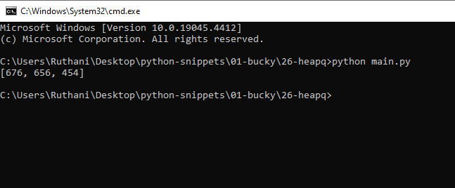

## 27-min

### main.py

```python

stock = {
	
	"google":489,
	"apple":329,
	'fb':32,
	'ama':234,
	'f':32,
	'MSFT':543

}

min_price=min(zip(stock.values(),stock.keys()))
print(min_price)

```

### Output

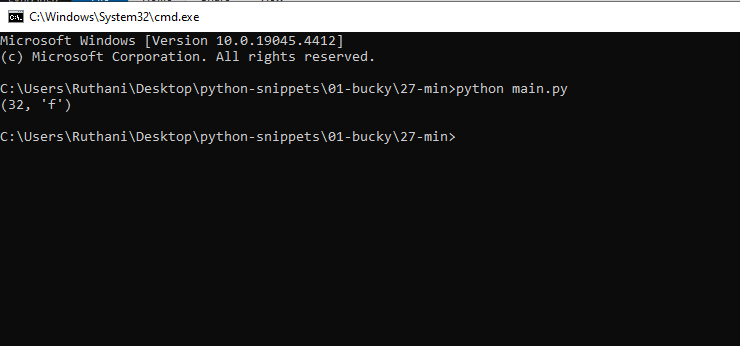


## 28-finding-most-frequent-items

### main.py

```python

from collections import Counter
text ="Lorem Ipsum is simply dummy text of the printing and typesetting industry. Lorem Ipsum has been the industry's standard dummy text ever since the 1500s, when an unknown printer took a galley of type and scrambled it to make a type specimen book. It has survived not only five centuries, but also the leap into electronic typesetting, remaining essentially unchanged. It was popularised in the 1960s with the release of Letraset sheets containing Lorem Ipsum passages, and more recently with desktop publishing software like Aldus PageMaker including versions of Lorem Ipsum."
words = text.split()

Counter = Counter(words)
top = Counter.most_common(3)
print(top)


```

### Output

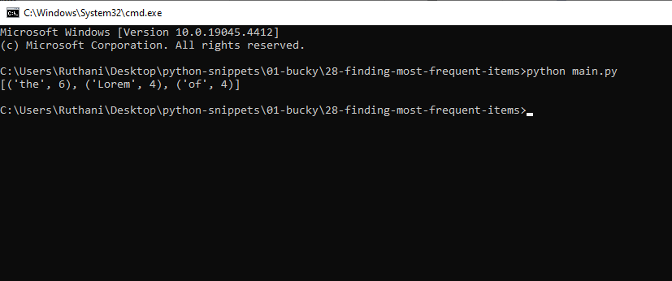

## 29-sorted

### main.py

```python

from operator import itemgetter

users=[

	{'fname':'joker', 'lname':'hacker'},
	{'fname':'kuna', 'lname':'rakulna'},
	{'fname':'guna', 'lname':'doer'},
	{'fname':'aaker', 'lname':'hacker2'},

]

for x in sorted(users, key = itemgetter('fname')):
	print(x)

```

### Output

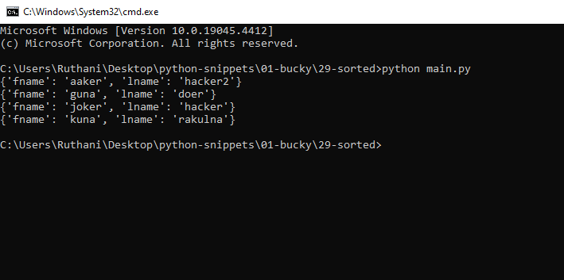


