# MIT Snippets

## example-1.py

```python

x=3
x=x*x
print(x)

n=input("Enter a number: ")
print(n)
v

```
## output

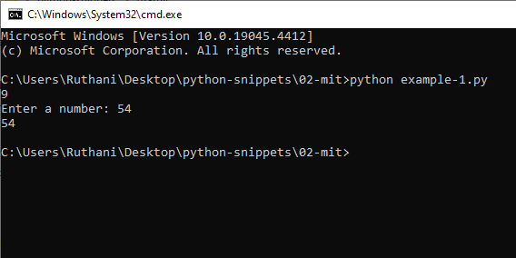

## example-2.py

```python

x=16

if x%2==0:
	print("Even Number")

else:

	print("Odd Number")

```
## output

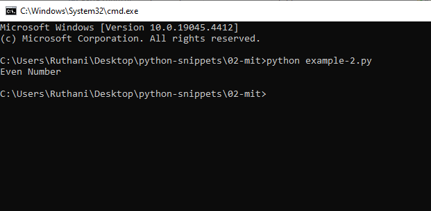

## example-3.py

```python

x=2
y=5
z=11
print(x,y,z)

if x < y:
	if x < z:
		print("X is least")
	else:
		print("Z is least")
else:
	print("Y is least")


```
## output

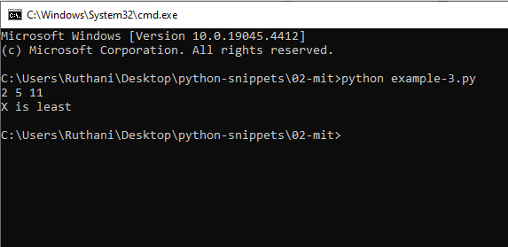

## example-4.py

```python

y=0
x=3

itersLeft=x

while (itersLeft>0):
	y=y+1
	itersLeft=itersLeft-1
print(y)
	

```
## output

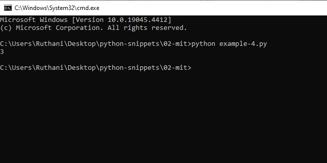


## example-5.py

```python

x = int(input('Enter a perfect square : '))
guess = 0 # Our guess answer
while guess**2 < x:
    guess += 1 # Shorthand for guess = guess + 1
print('Square root of ' + str(x) + ' is ' + str(guess))


```
## output

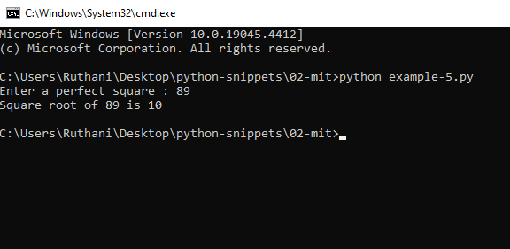

## example-6.py

```python

x = 1515361
ans = 0
if x >= 0:
	while ans*ans < x:
	 	ans = ans +1
	if ans*ans != x:
		print(x,' is not a perfect square')
	else:
		print(ans)
else:
	print(x,'is a negative number')

```
## output

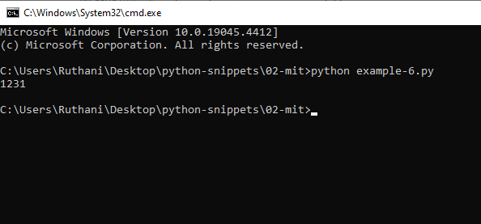

## example-7.py

```python

x=16
ans=0
while ans*ans <= x:
	ans=ans+1

print(ans)

```
## output

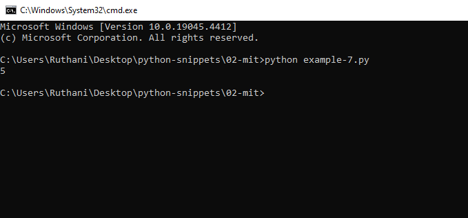

## example-8.py

```python

def squrt(x):
	ans=0
	if x>=0:
		while ans*ans < x:ans = ans +1
		if ans*ans!=x:
			print(x)
			return None
		else: return ans
	else:
		print(x,'Is a negative number')
		return None


x = squrt(16)

print(x)


```
## output

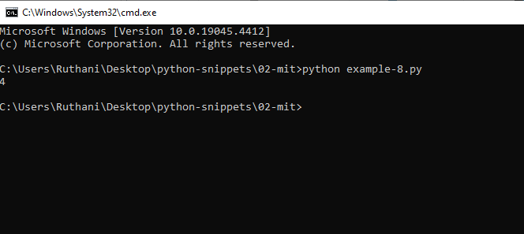

## example-9.py

```python

def expl(a,b):
	ans=1
	while(b>0):
		ans*=a
		b-=1
	return ans

print(expl(2,3))

```
## output

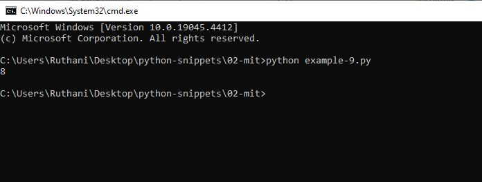

## example-10.py

```python

def pow(base,exp):
	x=1;
	for u in range(exp):
		x=x*base
	return x


print(pow(2,3));


```
## output

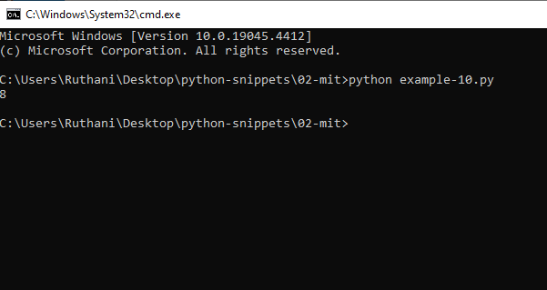

## example-11.py

```python

def exp2(a,b):
	if a == 1:
		return a
	else:
		return a*exp2(a,b-1)
		

```
## output

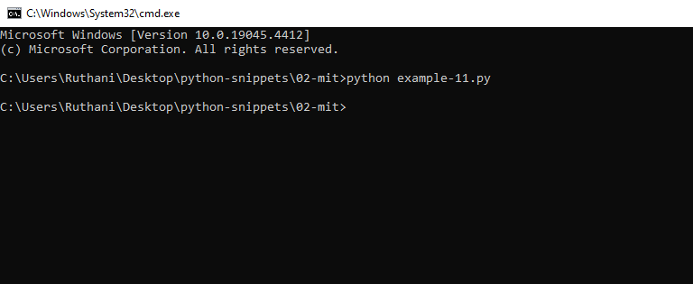


## example-12.py

```python

def exp3(a,b):
	if b == 1:
		return a
	if (b%2)*2==b:
		return exp3(a*a,b/2)
	else:
		return a*exp3(a,b-1)

s = exp3(2,4)
print(s)

```
## output

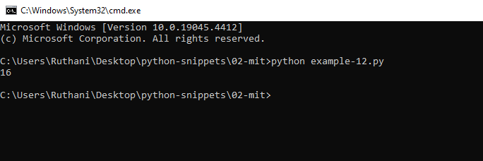

## example-13.py

```python

def numBin(num):
	if num >=1:
		print(round(num%2))
		numBin(num/2)

#numBin(8);


def numBin2(num):
	while num>=1:
		print(round(num%2))
		num=num/2

numBin2(10)


```
## output

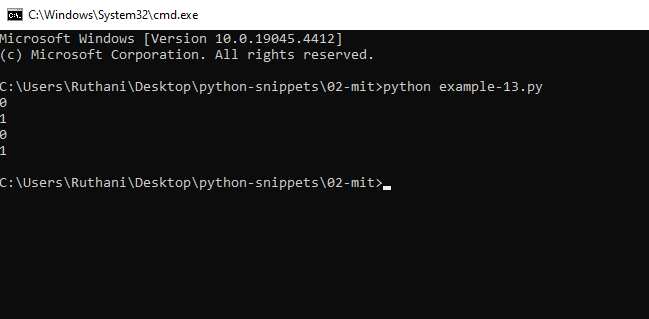

## example-14.py

```python

def binary_search(item_list,item):
	first = 0
	last = len(item_list)-1
	found = False
	while( first<=last and not found):
		mid = (first + last)//2
		if item_list[mid] == item :
			found = True
		else:
			if item < item_list[mid]:
				last = mid - 1
			else:
				first = mid + 1	
	return found
	
#print(binary_search([1,2,3,5,8], 6))
print(binary_search([1,2,3,5,8], 5))

```
## output

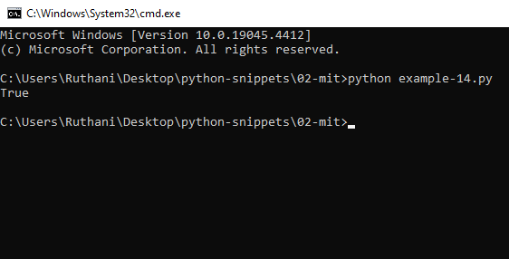