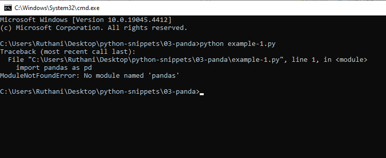
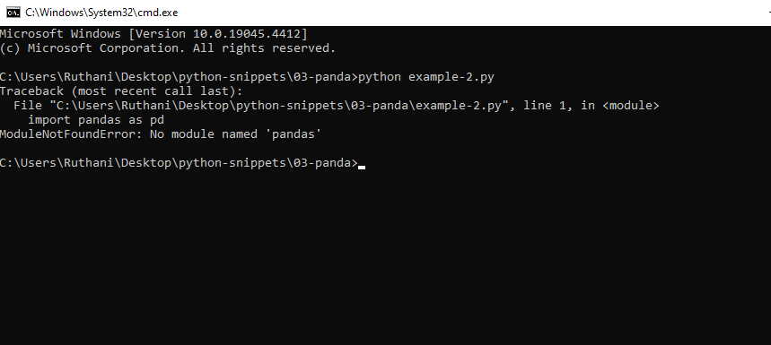
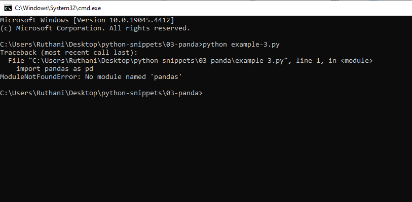
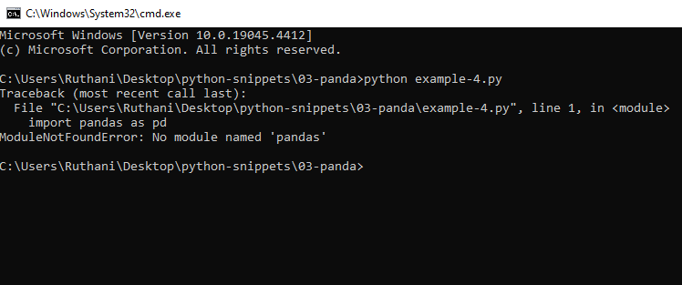
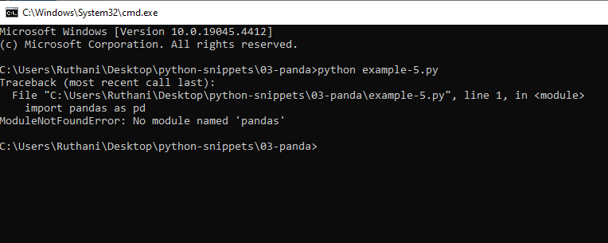

# 03-panda Snippets

## example-1.py

```python

import pandas as pd

poke = pd.read_csv('pokemon_data.csv') #load+data

print(poke.tail(5)) #tail will get 5 rows of bottom data
		#head() will read first above data


```
## output




## example-2.py

```python

import pandas as pd

poke = pd.read_csv('pokemon_data.csv') #load+data

print(poke) #print


```
## output




## example-3.py

```python

import pandas as pd


df_xlsx = pd.read_excel("pokemon_data.xlsx") #read excel files
print(df_xlsx)

```
## output



## example-4.py

```python

import pandas as pd
#load txt file and delimiate by \t
df = pd.read_csv("pokemon_data.txt",delimiter = '\t') # by tab 
print(df.columns) #print all the columns


```
## output



## example-5.py

```python

import pandas as pd

df = pd.read_excel("pokemon_data.xlsx") #read excel files

#print(df['Name']) #print specific data
#print(df['Name'][0:5]) #print 0-5

print(df.describe())


```
## output

