# 05-pillow Snippets

## 01-open-image

### main.py

```python


from PIL import Image

img = Image.open("img1.jpg")
print(img.size)
print(img.format)
img.show();


```
### output

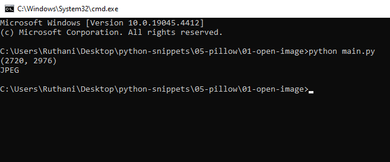
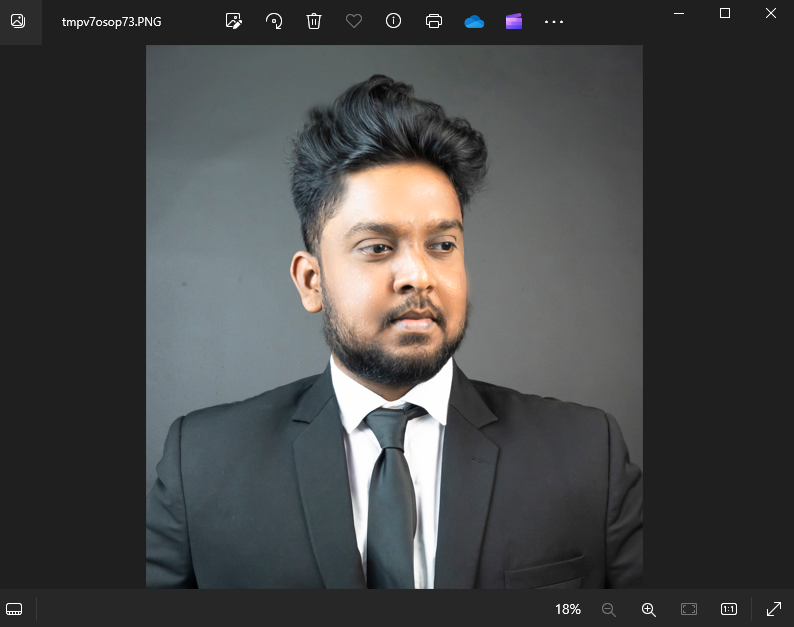


## 02-crop-image

### main.py

```python

from PIL import Image

img = Image.open("img2.jpg")
area = (0,0,1500,1500) #The First two values are coordiates
copped_img = img.crop(area); #croped the IMG depanding on the vlaue of area
copped_img.show();#show it.

```
### output

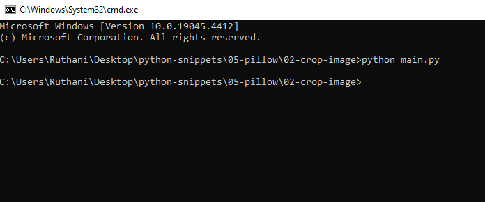
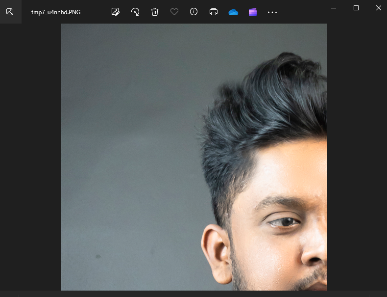

## 03-paste-image

### main.py

```python

from PIL import Image

mainImg = Image.open("img1.jpg")
headImg = Image.open("head.png")

area = (800,300)
mainImg.paste(headImg,area)

mainImg.show()


```
### output

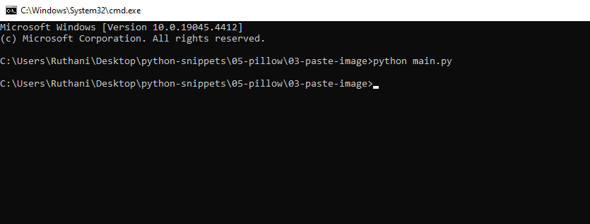


## 04-convert-to-grayscale

### main.py

```python

from PIL import Image

TheImage = Image.open("img1.jpg")
r,g,b = TheImage.split()

r.show()
g.show()
b.show()

#This program gets the primary color of the image


```
### output

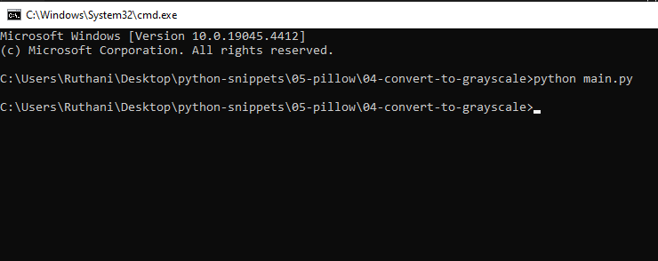


## 05-convert-the-color

### main.py

```python

from PIL import Image

TheImage = Image.open("img1.jpg")
r,g,b = TheImage.split()
new_img = Image.merge("RGB",(g,r,r))
new_img.show()
new_img.save("new_img.jpg")


```
### output

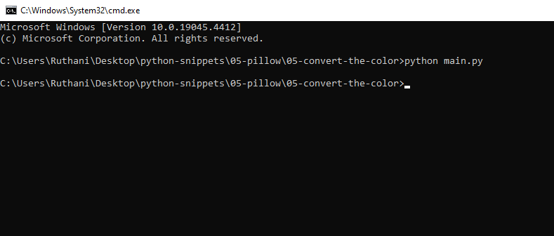


## 06-flip-rotate-image

### main.py

```python

from PIL import Image

TheImage = Image.open("img1.jpg") #This is Image

sq = TheImage.resize((200,200))   #Here we resize the image.
f_b=TheImage.transpose(Image.FLIP_TOP_BOTTOM) #flip the image
spin=TheImage.transpose(Image.ROTATE_90)      #rotate

f_b.show() 
sq.show()
spin.show()


```
### output

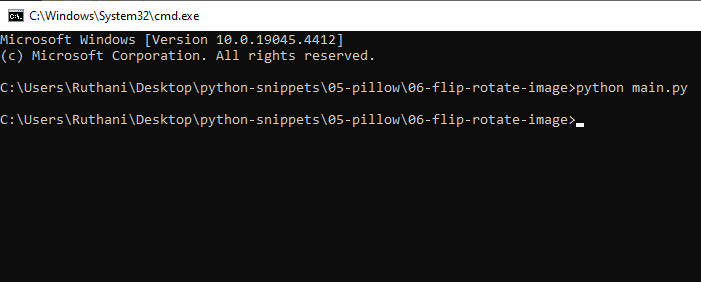


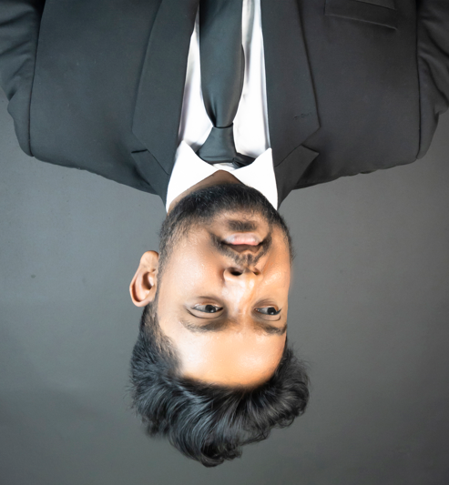

## 07-black-and-white

### main.py

```python

from PIL import Image


TheImage = Image.open("img1.jpg") #This is Image
out_put = TheImage.convert("L")   #To black and White
out_put.show()


```
### output

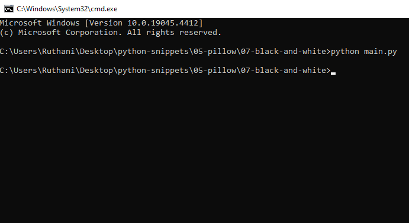


## 08-effects

### main.py

```python

from PIL import Image
from PIL import ImageFilter

TheImage = Image.open("img1.jpg") #This is Image
blur = TheImage.filter(ImageFilter.BLUR)
detail = TheImage.filter(ImageFilter.DETAIL)
edg = TheImage.filter(ImageFilter.FIND_EDGES)
blur.show()
detail.show()
edg.show()


```
### output

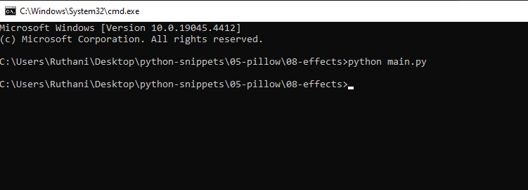


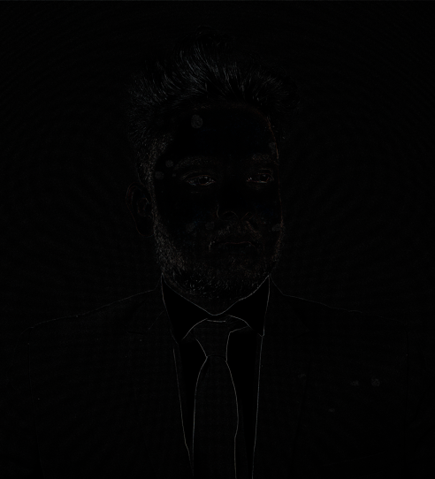