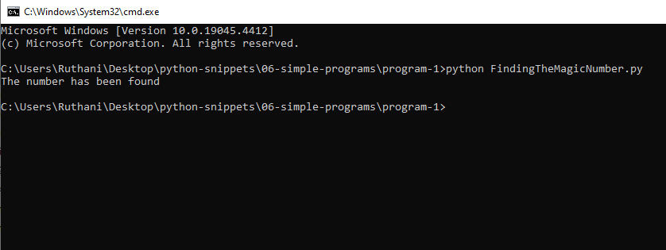
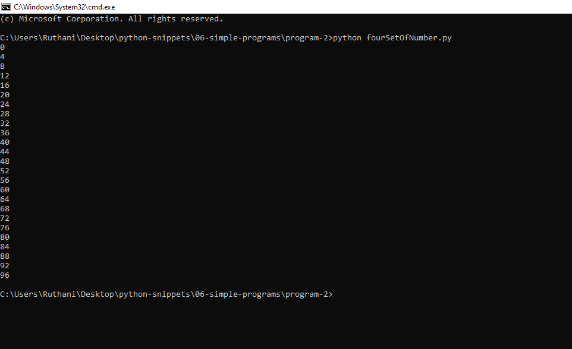
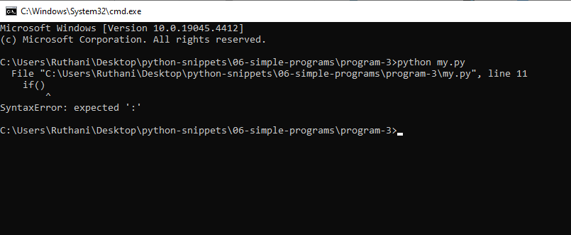

# 06-simple-programs Snippets

## program-1

### FindingTheMagicNumber.py

```python

magicNum=69

for x in range(100):
	
	if x is magicNum:
		print("The number has been found")
		break #after finding the magicNum break the looping .
		
		
# sinle line comment

'''
This the multi level comments.

'''


```
### output




## program-2

### fourSetOfNumber.py

```python

for x in range(100):

	if x%4==0:
		print(x)


```
### output




## program-3

### my.py

```python
groceries=["milk","Biscats","Pizza",'apple']

if "do" in groceries:
	print("Yes,Do not need to buy")

else:
	print("No,You need to but it.")


if()


```
### output

