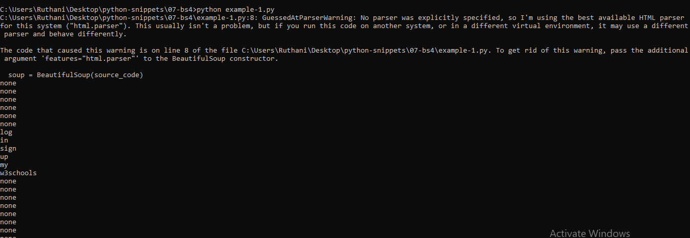
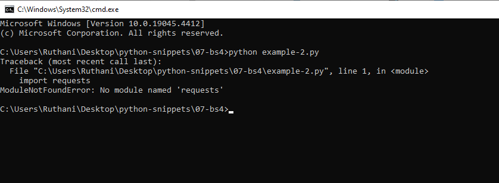
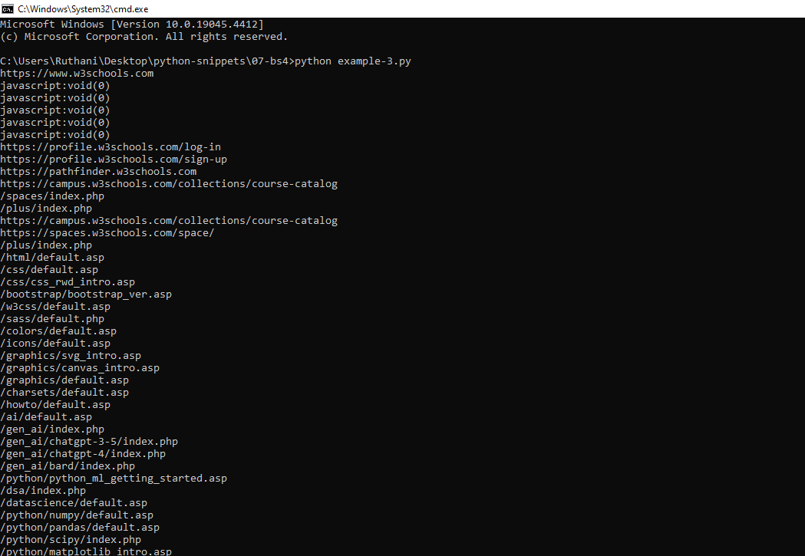
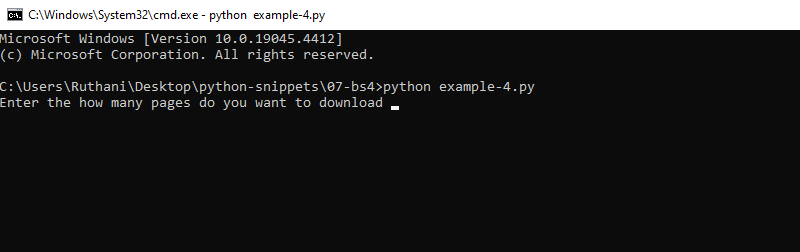

# 07-bs4-Snippets

## example-1.py

```python

import requests
from bs4 import BeautifulSoup
import operator

def start(url):
	word_list = []
	source_code = requests.get(url).text
	soup = BeautifulSoup(source_code)

	for post_text in soup.findAll('a',{'class':'w3-bar-item'}):
		content = str(post_text.string)
		words = content.lower().split();
		for each_word in words:
			print(each_word)
			word_list.append(each_word);

start('https://www.w3schools.com/')


```
## output




## example-2.py

```python

import requests
from bs4 import BeautifulSoup
import operator

def start(url):
	word_list = []
	source_code = requests.get(url).text
	soup = BeautifulSoup(source_code)

	for post_text in soup.findAll('a',{'class':'w3-bar-item'}):
		content = str(post_text.string)
		words = content.lower().split();
		for each_word in words:
			word_list.append(each_word);
	clean_up_list(word_list)


def clean_up_list(word_list):
	clean_word_list = []
	for word in word_list:
		symbols = "~!@#$%^&*()_+}{'.,/[]';,-=\":?>"
		for i in range(0,len(symbols)):
			word = word.replace(symbols[i],"");
		if len(word) > 0:
			clean_word_list.append(word)
			create_dictionary(clean_word_list)


def create_dictionary(clean_word_list):
	word_count = {}
	for word in clean_word_list:
		if word in word_count:
			word_count[word] += 1
		else:
			word_count[word] = 1

	for key,value in sorted(word_count.items(),key = operator.itemgetter(1)):
		print(key,value)

start('https://www.w3schools.com/')


```
## output




## example-3.py

```python

import requests
from bs4 import BeautifulSoup

def trade_spider():

    url = 'https://www.w3schools.com'
    source_code = requests.get(url)
    plain_text = source_code.text
    soup = BeautifulSoup(plain_text, "html.parser")
    for link in soup.findAll('a',{'class':'w3-bar-item'}):
        style=link.get('href')
        print(style)


trade_spider()


```
## output



## example-4.py

```python
import  requests
import urllib.request
import random
import os
from bs4 import BeautifulSoup

def webisteDownloader(maxPage):
    page = 1
    number = 0
    while page <= maxPage:
        url='http://wallpaperswide.com/computers-desktop-wallpapers/page/' +str(page)
        source_code = requests.get(url)    #Get the source_code of the page.
        text_code = source_code.text       #Converted into text.
        bs4Method = BeautifulSoup(text_code,"html.parser")        #Converted as the BeautifulSoup Object.
        for link in bs4Method.findAll('img', {'class': 'thumb_img'}):
            style = link.get('src')
            name=str(number)+'.jpg'
            number+=1
            newFolder=r'images/'
            if not os.path.exists(newFolder):
                os.mkdir(newFolder)
            urllib.request.urlretrieve(style,newFolder+name)
        page +=1


numbers= input("Enter the how many pages do you want to download ")
webisteDownloader(int(numbers))


```
## output



